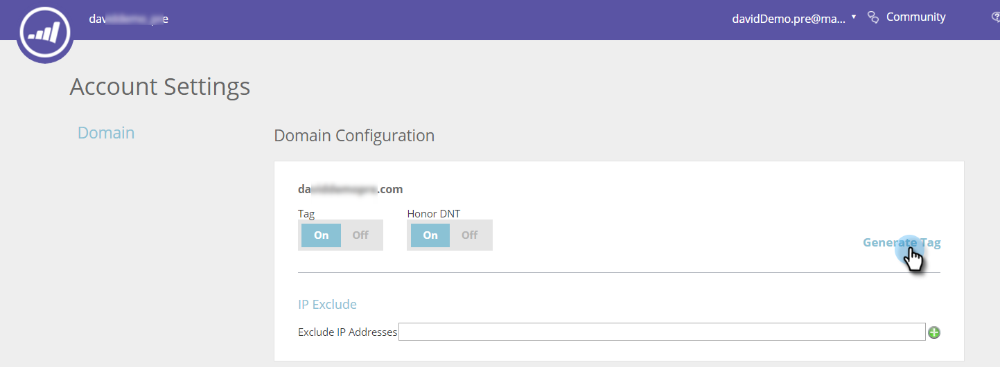

# Deploy the JavaScript for Content-AI {#deploy-the-javascript-for-content-ai}

To use Predictive Content, you need to generate and set up your the RTP (Web Personalization) tag.

## Generate Tag {#generate-tag}

1. Login to your Predictive Content account. Go to **[!UICONTROL Account Settings]**.

   

1. In **[!UICONTROL Domain Configuration]**, locate the relevant domain and click **[!UICONTROL Generate Tag]**.

   

1. Copy and paste the Web Personalization tag into the HTML of your website.

   

   >[!NOTE]
   >
   >Copy the Web Personalization JavaScript tag and paste it as the first script in the header of your pages, between the `<head> </head>` tags. See more detailed [implementation instructions here](/help/marketo/product-docs/web-personalization/rtp-tag-implementation/deploy-the-rtp-javascript.md).

1. Verify the tag appears on all pages, including landing pages and sub-domains. Check this by right-clicking on your website’s page. Go to **[!UICONTROL View Page Source]** in a web browser. Search: ‘RTP’.

1. Confirm that the Tag toggle set to **[!UICONTROL ON]**.
