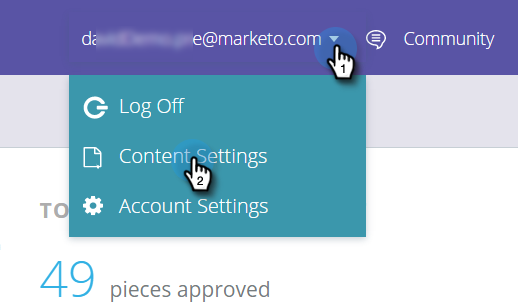
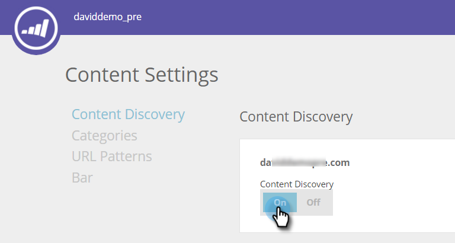

# Enable Content Discovery {#enable-content-discovery}

The Content Discovery feature automatically discovers and tags your already existing content (including case studies, blog posts, videos, press releases, etc.) from your website and tracks the number of views on these materials.  Predictive Content uses the discovered content, employing predictive analytics to determine which is your top performing content and recommends the best content to the right person.

1. Go to **[!UICONTROL Content Settings]**.

   

1. Turn Content Discovery to **[!UICONTROL On]**.

   

Setting [!UICONTROL Content Discovery] to [!UICONTROL On] will auto-discover a PDF or video content when any web visitor clicks the file or watches the video. This content piece (URL, content name and image URL) is added and then tracked under the All Content page. When auto-discovering video, we discover a video when a web visitor clicks and watches an embedded video from YouTube, [!DNL Vimeo], or [!DNL Wistia]. For auto-discovering other content, you would need to [create content patterns](/help/marketo/product-docs/predictive-content/getting-started/create-content-patterns.md).
