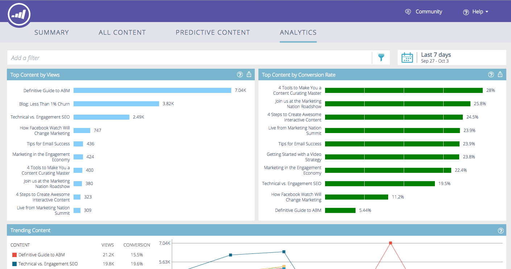
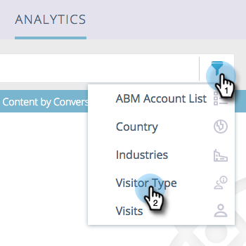
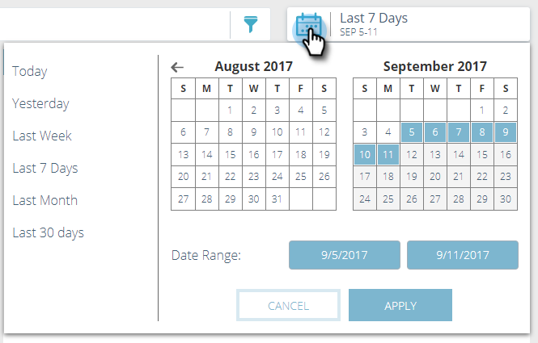
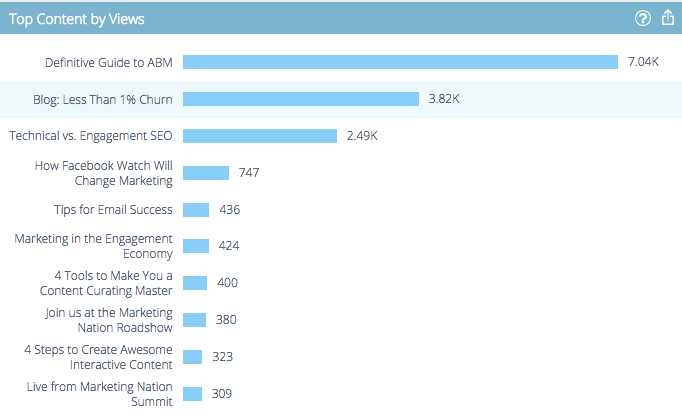
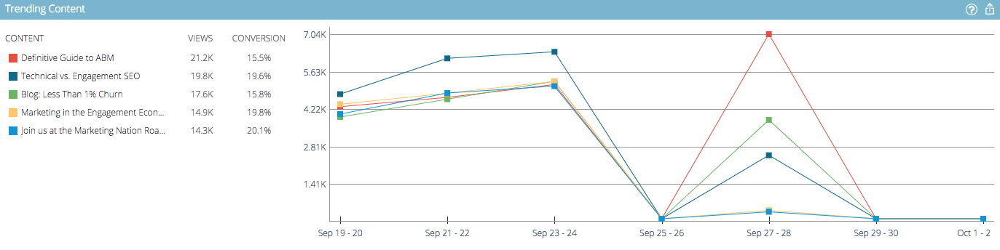
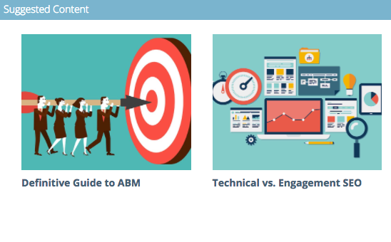
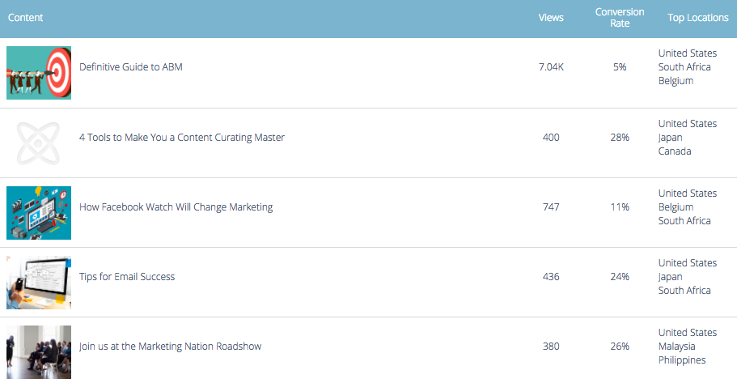

# Predictive Content Analytics Overview {#predictive-content-analytics-overview}

Use content analytics to gain further insights into your existing content, learn (based on AI and Predictive algorithms) what content works for your audiences, and increase ROI from your marketing efforts.

>[!NOTE]
>
>The [!UICONTROL Analytics] tab and content analytics features are available exclusively with Marketo Predictive Content.

## Overview {#overview}

On the Summary page, click **[!UICONTROL Analytics]**.

[!UICONTROL Analytics] comprises several sections: [!UICONTROL Top Content by Views], [!UICONTROL Top Content by Conversion Rate], [!UICONTROL Trending Content], [!UICONTROL Suggested Content], and [!UICONTROL Content].

Hover over the question mark in any section header for additional details.

Click the export button to export that section's results via Excel.

You can filter results by various attributes/properties (e.g. [!UICONTROL ABM Account List], [!UICONTROL Country], etc.).

Click the calendar icon to change the dates of the reflected data. Choose a preset amount of time, or a specific date range.

## [!UICONTROL Top Content by Views] {#top-content-by-views}

Displays the top content pieces by number of views per the selected date range.

## [!UICONTROL Top Content by Conversion Rate] {#top-content-by-conversion-rate}

Displays the top converting content by conversion rate for the selected date range.

>[!NOTE]
>
>**Definition**
>
>**Conversion Rate**: A percentage calculated by direct conversions divided by clicks.

## [!UICONTROL Trending Content] {#trending-content}

Displays a content piece's surge in popularity by looking at the last two-week increase in views compared to the same previous period.

## [!UICONTROL Suggested Content] {#suggested-content}

Displays content we suggest you promote in your Marketing Activities based on the filter you defined.

Hover over an image in Suggested Content to reveal available options.

>[!NOTE]
>
>See those icons at the bottom? Left to right they are: View Content, Export to CSV, Approve Content.

## [!UICONTROL Content] {#content}

Search for the desired content piece and click it to see additional details, including: the visitors viewing it, new versus returning, known and anonymous, the top locations the visitors came from when viewing the content, and the top inferred industries they come from.

>[!NOTE]
>
>Similar content is based on the selected content piece and is calculated by an association rules algorithm. The results represent content pieces that visitors will most likely click, depending on the selected piece and past visitor behavior. It does not take the filter or date range into account.
