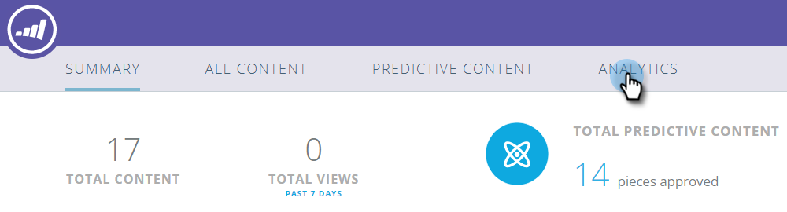
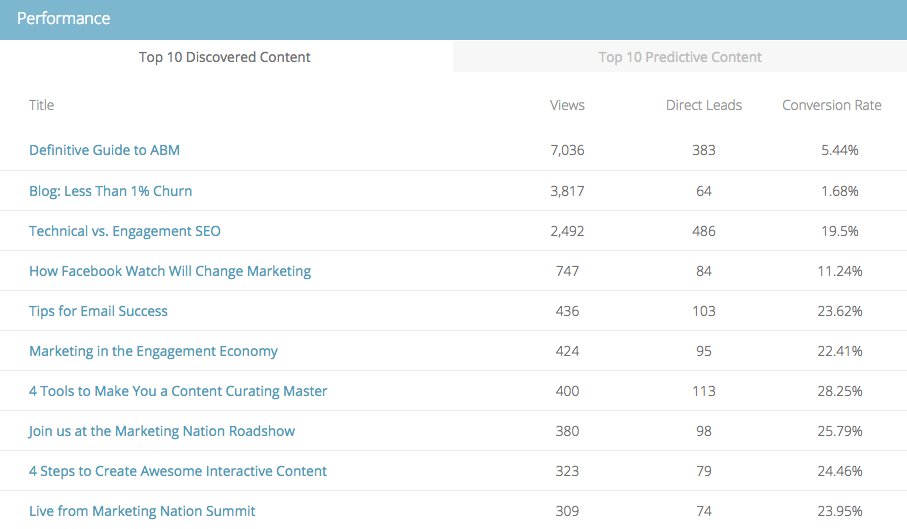
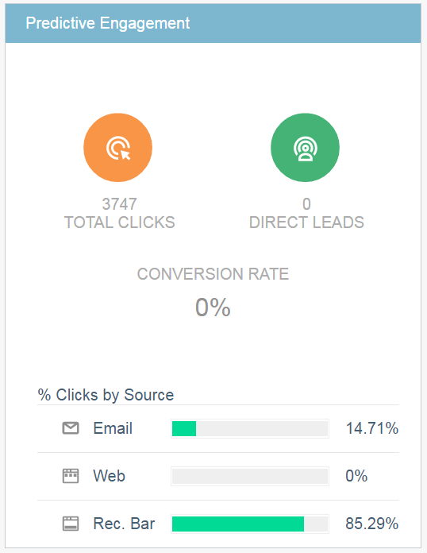

# The Predictive Content Summary {#the-predictive-content-summary}

The Predictive Content Summary displays the information you need about about your predictive content at a glance, with tables, graphs, and current numbers.  

## Top Bar {#top-bar}

The top bar shows current numbers for content and views, and how many pieces are enabled. Select a view of the past 7 or 30 days for the entire page in the upper right.

## Performance Table {#performance-table}

Here's where you can see your top 10 pieces of discovered content, including views, direct leads and conversion rate.

## [!UICONTROL Predictive Engagement] {#predictive-engagement}

See your conversion rate by comparing total clicks and direct leads, and compare performance of the different sources.

## [!UICONTROL Content Trend by Views]  {#content-trend-by-views}

Compare how your views of all content match up with your predictive content.

## [!UICONTROL Top Categories by Engagement] {#top-categories-by-engagement}

Which categories of content are most engaging? See it in this graph.

>[!NOTE]
>
>If you click a category link (examples in the above image: leadgen, email, etc,.) it opens the All content page with the category you clicked on added to the filter, displaying the content analytics in that category.
