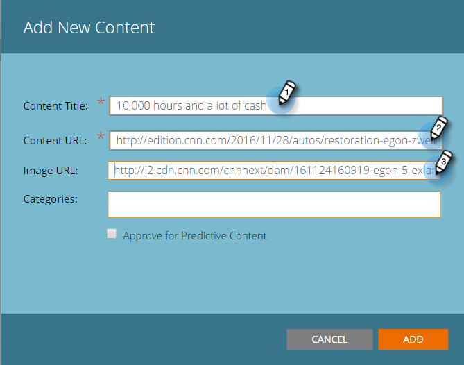
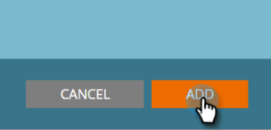

# Add New Content {#add-new-content}

You can easily add content manually to the All Content page.

1. Click the **Add Content** drop-down and select **Add Content**.

   

1. Enter a title and URL, and an image URL if you need one.

   

1. To add categories, click the field and select from the drop-down.

   

1. Click **Add**.

   

1. The new title now appears on the **All Content** page. Note that it's not approved for predictive content yet.

   

1. Here's how to add it to [Predictive Content](/help/marketo/product-docs/predictive-content/working-with-all-content/approve-a-title-for-predictive-content.md).
