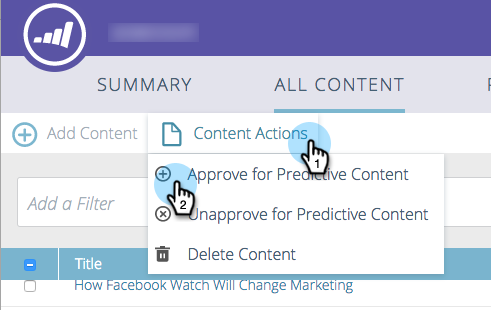
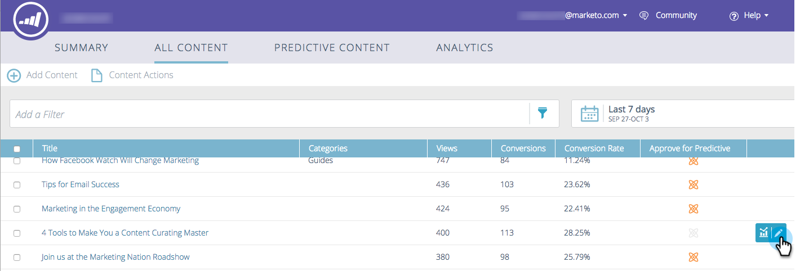

# Approve a Title for Predictive Content {#approve-a-title-for-predictive-content}

You can add any title on your [!UICONTROL All Content] page to predictive content by approving it on the [!UICONTROL All Content] page or the [!UICONTROL Edit Content] pop-up.

## [!UICONTROL All Content] Page {#all-content-page}

1. Check the box next to the piece of content.

   

1. Click the **[!UICONTROL Content Actions]** drop-down and select **[!UICONTROL Approve for Predictive Content]**.

   

## [!UICONTROL Edit Content] Pop-up {#edit-content-pop-up}

You can also approve titles for predictive content directly on the [!UICONTROL Edit Content] pop-up.

1. Hover over a piece of content and click the edit icon at the end of the row.

   

1. Check the **[!UICONTROL Approve for Predictive Content]** box on the [!UICONTROL Edit Content] popup and click **[!UICONTROL Save]**.

   

Whichever way you use, the [!UICONTROL Approve for Predictive Content] icon now appears in the row.

And you now can see the title displayed on the [!UICONTROL Predictive Content] page.

