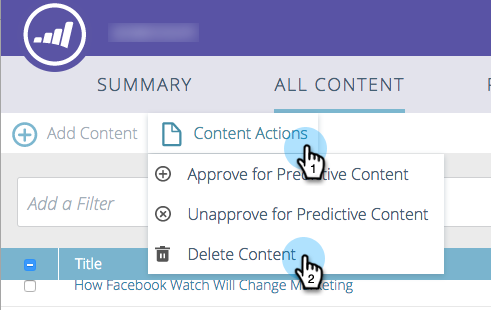

# Delete Content {#delete-content}

When you don't need a piece of content anymore, it's easy to get rid of it.

1. Check the box next to the piece of content you want to remove.

   

1. Click the **Content Actions** drop-down and select **Delete Content**.

   

   That's it.
