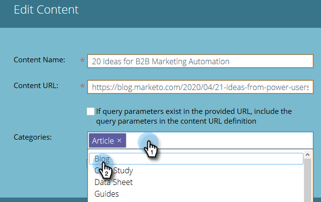
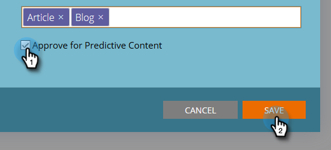

# Edit Content {#edit-content}

You can make some edits to listings on the All Content Page.

1. On the **All Content** page, hover over the row of the title you want to edit and click the edit icon.

   

1. Make changes to the Content Title and Content URL (query parameters checkbox is optional).

   

1. Click the **Categories** field to add/remove categories. Select new ones from the drop-down. You can remove a currently selected category by clicking its **X**.

   

1. Check the **Approve for Predictive Content** box to approve, or uncheck the box to unapprove. Click **Save** when done.

   

