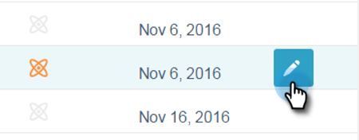
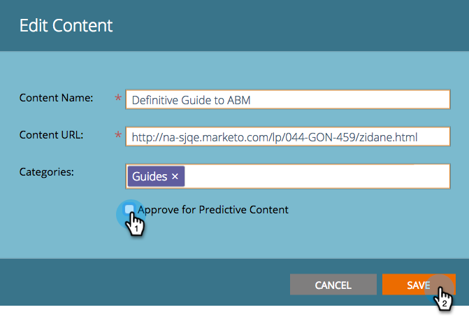

# Unapprove a Title for Predictive Content {#unapprove-a-title-for-predictive-content}

You can unapprove any title for predictive content on your All Content page or on the Edit Content pop-up.

## All Content Page {#all-content-page}

1. On the All Content page, check the box next to the piece of content to select it.

   

1. Click the **Content Actions** drop-down and select **Unapprove for Predictive Content**.

   

## Edit Content Pop-up {#edit-content-pop-up}

You can unapprove a title while you're editing it.

1. Hover over a piece of content, then click the edit icon at the end of the row.

   

1. Uncheck the **Approve for Predictive Content** box and click **Save**.

   

No matter which method you use, the approve icon is gone on the All Content page, and the title disappears from the Predictive Content page.

