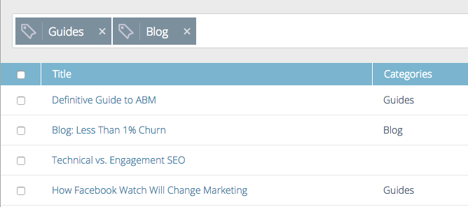
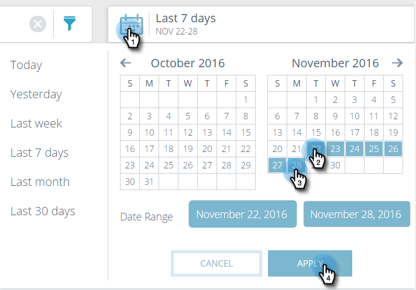

# Understanding All Content {#understanding-all-content}

>[!NOTE]
>
>Depending on the purchase date, your Marketo subscription may include either Marketo Predictive Content or Content`AI`. For those using Predictive Content, Marketo is enabling Content`AI` Analytics features until April 30, 2018. To keep these features beyond that date, please contact your Marketo Customer Success Manager to upgrade to Marketo Content`AI`.

The All Content page displays all content that has been discovered or added manually.   

The page fields include:

* **Title**: The name of the piece of content
* **Categories**: Created by you and used to group your predictive outcomes for web or email
* **Views**: Total clicks on discovered web content (including all sources)
* **Conversions**: The number of visitors who viewed a content piece and completed a form in the same visit
* **Conversion Rate**: A percentage calculated by direct conversions divided by clicks
* **Approve for Predictive**: Icon displays if the content is approved

You can add a new piece of content and track it, remove a piece of content, or approve a piece of content. After you approve content, you can edit it on the Predictive Content page.

## Filter Content by Categories  {#filter-content-by-categories}

Filter content by selecting one or more categories. Then, set up the date or date range for the content analytics, using standard or custom settings.

1. On the **All Content** page, click the filter icon and under **Category**, select one or more content category.

   

1. Now, only content in that category is displayed.

   

##  Display Analytics for a Date or Date Range {#display-analytics-for-a-date-or-date-range}

1. To display data for a specific date or date range, click the calendar icon and then select from the left panel. For a custom date range, click the first and last day of the date range on the calendar (as shown). Click **Apply**.

   

1. Now, analytics displays for content in the selected date range.

>[!NOTE]
>
>**Related Articles**
>
>* [Add New Content](add-new-content.md)
>* [Delete Content](delete-content.md)
>* [Approve a Title for Predictive Content](approve-a-title-for-predictive-content.md)
>* [Unapprove a Title for Predictive Content](unapprove-a-title-for-predictive-content.md)
>

