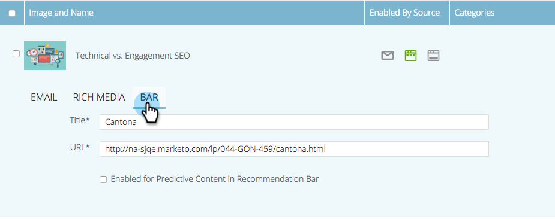
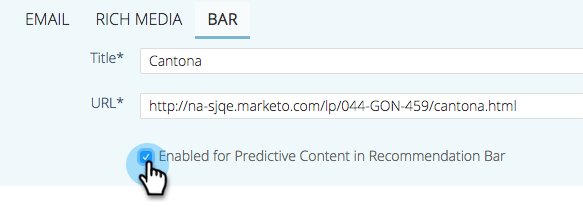

# Edit Predictive Content for the Recommendation Bar {#edit-predictive-content-for-the-recommendation-bar}

Here's how to set up your predictive content for the Recommendation Bar.

>[!PREREQUISITES]
>
>Content must be [approved for predictive content](/help/marketo/product-docs/predictive-content/working-with-all-content/approve-a-title-for-predictive-content.md) on the All Content page.

1. On the **Predictive Content** page, click a title to open the editor.

   

1. Click **Bar**.

   

1. Check the box to enable Predictive Content in the Recommendation Bar.

   

1. Click **Save**.

   
