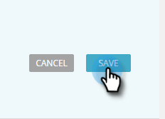

# Edit Predictive Content for the Recommendation Bar {#edit-predictive-content-for-the-recommendation-bar}

>[!NOTE]
>
>Depending on the purchase date, your Marketo subscription may include either Marketo Predictive Content or Content`AI`. For those using Predictive Content, Marketo is enabling Content`AI` Analytics features until April 30, 2018. To keep these features beyond that date, please contact your Marketo Customer Success Manager to upgrade to Marketo Content`AI`.

Here's how to set up your predictive content for the Recommendation Bar. 

>[!NOTE]
>
>**Prerequisites**
>
>Content must be [approved for predictive content](../../../../product-docs/predictive-content/working-with-all-content/approve-a-title-for-predictive-content.md) on the All Content page.

1. On the **Predictive Content** page, click a title to open the editor.

   

1. Click **Bar**.

   

1. Check the box to enable Predictive Content in the Recommendation Bar.

   

1. Click **Save**.

   

