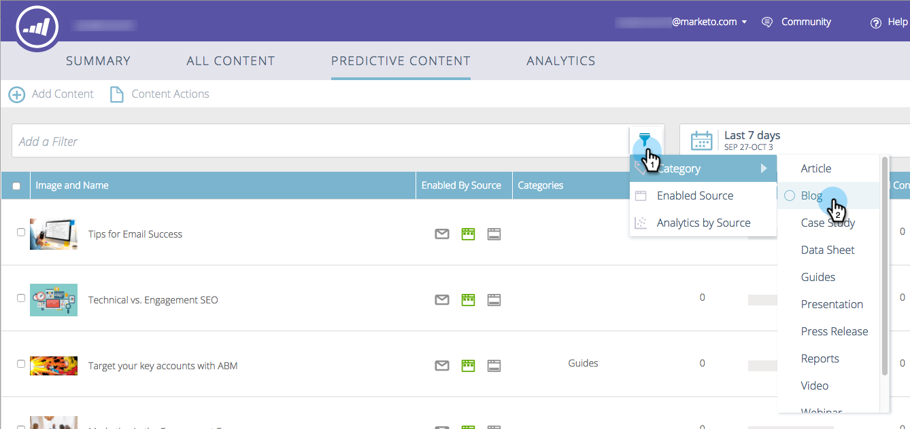
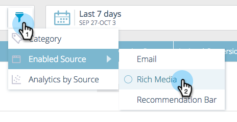
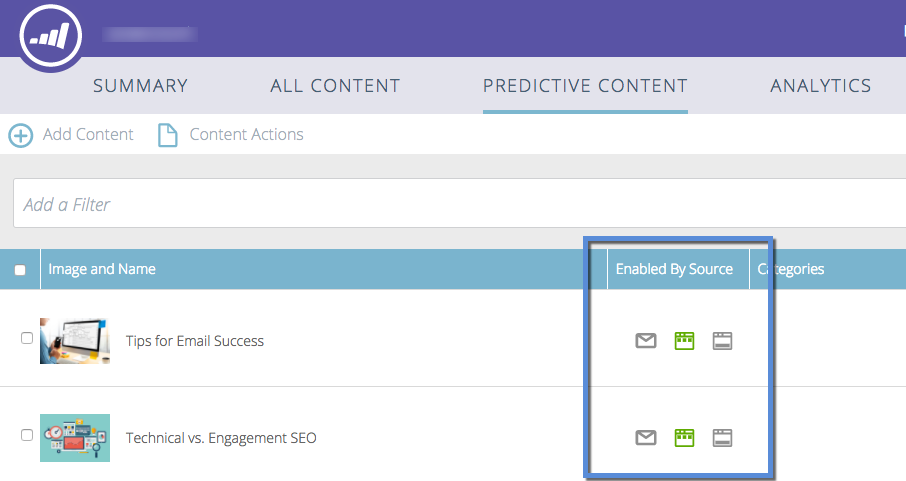
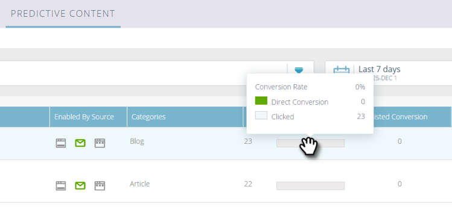

# Understanding Predictive Content {#understanding-predictive-content}

>[!NOTE]
>
>Depending on the purchase date, your Marketo subscription may include either Marketo Predictive Content or Content`AI`. For those using Predictive Content, Marketo is enabling Content`AI` Analytics features until April 30, 2018. To keep these features beyond that date, please contact your Marketo Customer Success Manager to upgrade to Marketo Content`AI`.

After you [approve a title for predictive content](../../../product-docs/predictive-content/working-with-all-content/approve-a-title-for-predictive-content.md), you work on it here. The Predictive Content page displays all of the titles you have approved for predictive content.

Page fields include:

* **Image and Title**: The name of the piece of content and selected image
* **Enabled by Source**: Shows if the title is approved for Rich Media, email, or the Recommendation Bar. 
* **Categories**: Created by you and used to group your predictive outcomes for web or email
* **Clicks**: Total clicks on recommended content (including all sources)
* **Conversion Rate**: A percentage calculated by direct conversions divided by clicks. Hover to see additional data (see below)
* **Assisted Conversion**: Visitors who clicked on recommended content in a past visit and completed a form later

## Filtering Content {#filtering-content}

**Category**

You can filter content by categories you've created. Click the filter icon and under **Category**, select one or more content categories. 

**Enabled Source**

Filter by each type of enabled content: Email, Rich Media, Recommendation Bar.

**Analytics by Source**

Filtering enabled content analytics gives you the ability to see how each source is performing.

## Display Analytics by Date {#display-analytics-by-date}

1. select the start and end dates on the right (as shown). Click **Apply**.

   

## View Table Data for Predictive Content {#view-table-data-for-predictive-content}

In the table, you can view which sources are enabled for predictive content, from left to right: Recommendation Bar, email, and Rich Media. Enabled sources are shown in green. You enable these when you [edit the content](http://docs.marketo.com/display/docs/edit+predictive+content).

Hover over the bar in the Conversion Rate column to view conversion rate, direct conversion, and clicked data.

>[!NOTE]
>
>**Definition**
>
>**Conversion Rate**: A percentage calculated by direct conversions divided by clicks
>
>**Direct Conversion**: Visitors who clicked on recommended content and completed a form in the same visit
>
>**Clicked**: Total clicks on recommended content (including all three sources)

>[!NOTE]
>
>**Related Articles**
>
>* [Predictive Content](http://docs.marketo.com/display/docs/predictive+content)
>* [Edit Predictive Content](http://docs.marketo.com/display/docs/edit+predictive+content)
>

