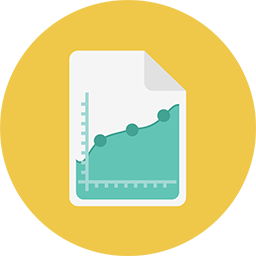

# Reporting {#reporting}

Actionable insights. That's what you get with Marketo reporting. You can even have them delivered right to your inbox. 
** Basic Reporting** [Basic Reporting Get started with the basics. Email, web, and person reports, oh my!](https://docs.marketo.com/display/DOCS/Basic+Reporting)     ** Revenue Cycle Analytics** [Revenue Cycle Analytics Go hardcore with time-series data analytics.](https://docs.marketo.com/display/DOCS/Revenue+Cycle+Analytics)     ** Performance Insights** [Performance Insights View all your campaign performance KPIs in one place.](https://docs.marketo.com/display/DOCS/Marketing+Performance+Insights)     ** Email Insights** [Email Insights Explore powerful insights using your historical data.](https://docs.marketo.com/display/DOCS/Email+Insights) 