# Advanced BI Analytics Overview {#advanced-bi-analytics-overview}

Advanced BI Analytics (formerly known as Revenue Explorer and Advanced Report Builder) offers a flexible reporting and visualization interface on Marketo Engage data, providing granular details about progression, performance, and more. It features richer interactivity and visualization, faster performance, and a more seamless and intuitive user experience.

These enhancements help you save time, discover more valuable insights, drive optimization, and share more compelling data stories with colleagues and stakeholders.

>[!PREREQUISITES]
>
>To access this feature, you must have purchased the Advanced BI Analytics add-on. Please contact the Adobe Account Team (your Account Manager) for details.

## Key features and benefits {#key-features-and-benefits}

* **High-performance Query Engine**: Delivers 5x faster performance on large datasets, enabling quicker data processing, faster report loading, and a smoother analytic experience.

* **Rich and Engaging Visualization**: Vast, expanded collection of built-in visualization options, including charts, maps, and KPI indicators, that make dashboards more insightful and impactful and significantly enhance data storytelling.

* **Advanced Interactivity and Dynamic Filtering**: Apply dynamic slicers, cross-filtering, and interdependent filters across visuals. Multi-page reports support advanced drill-down, drill-up, and drill-through, ensuring effortless data exploration.

* **Intuitive Report Authoring Interface**: A point-and-click experience simplifies report creation, including multi-page drill-through reports. The interface allows users to design complex, interactive reports without requiring deep technical expertise.

* **Easy Sharing, Including PowerPoint Export**: Built-in sharing functionality makes sharing insights effortless. Among other destinations, users can easily generate presentation-ready PowerPoint slides.

## Create a report {#create-a-report}

1. In your My Marketo, click the **[!UICONTROL Advanced BI Analytics]** tile.

   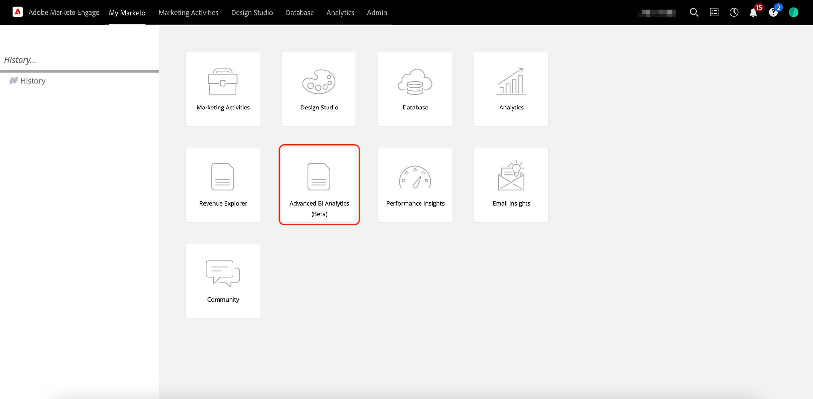{width="800" zoomable="yes"}

1. In the **[!UICONTROL Reports]** tab, click **[!UICONTROL Create Report]**.

   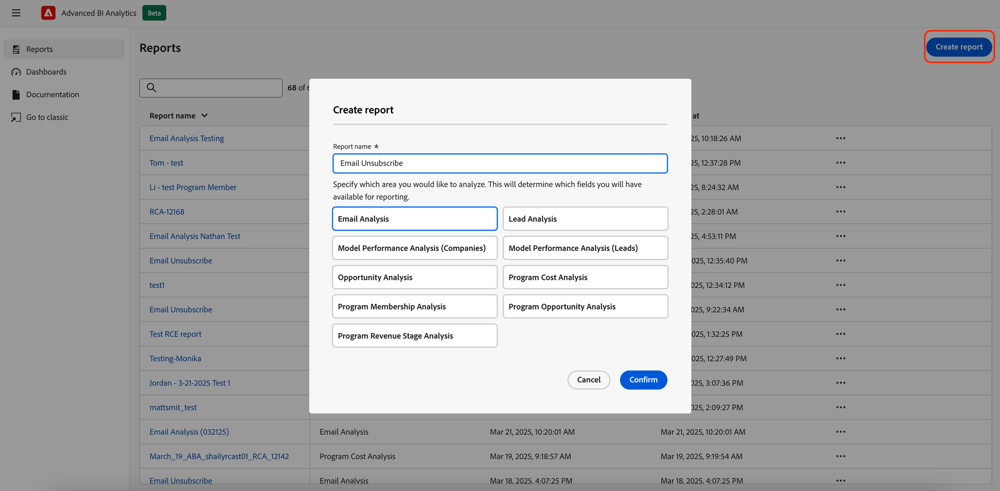{width="800" zoomable="yes"}

1. Select the desired measures.

   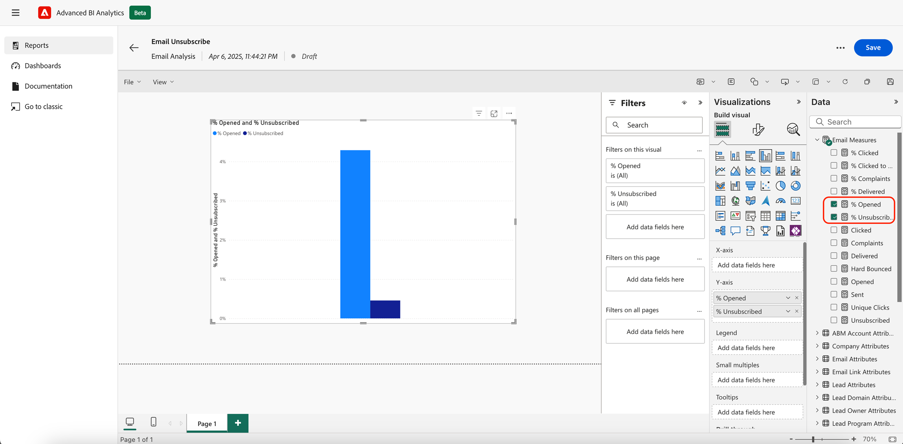{width="800" zoomable="yes"}

1. Select the desired dimensions.

   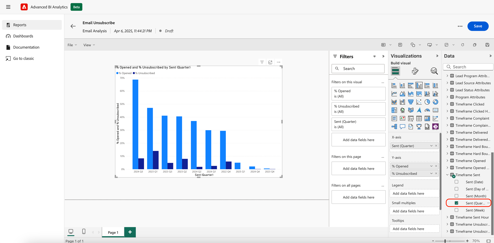{width="800" zoomable="yes"}

1. Choose your preferred visualization.

   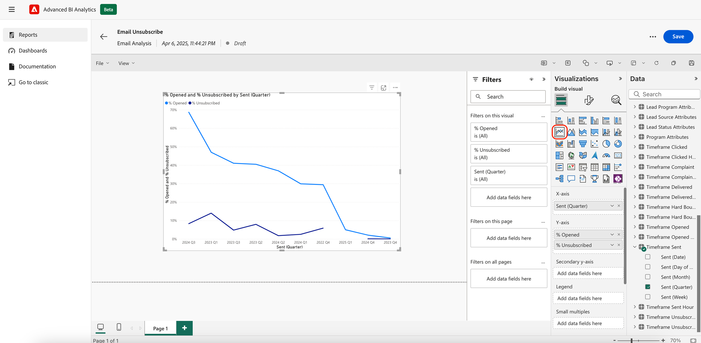{width="800" zoomable="yes"}

1. Add filters by drag-and-dropping a dimension attribute.

   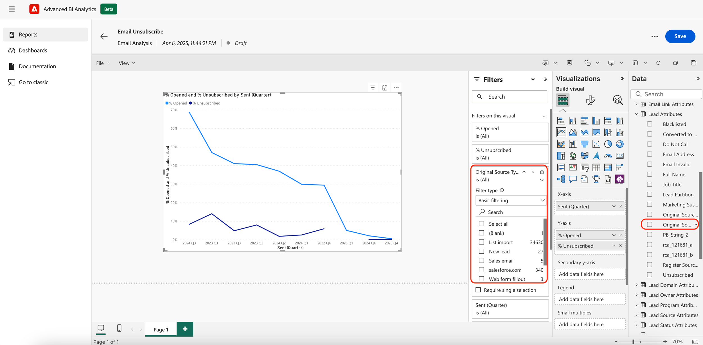{width="800" zoomable="yes"}

## Export a report {#export-a-report}

When exporting a complete report, your export options are PDF and PPT. If you need your data in .XLS or .CSV, you can do so by exporting individual visualizations ([see below](#export-a-visualization)).

>[!BEGINTABS]

>[!TAB From the Reports page]

1. On the Reports page, click the 'more' icon (...) of the desired report and select **Export**. 

   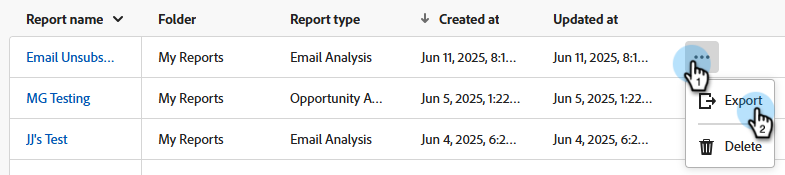

1. Choose PDF or PPT and click **Export**.

   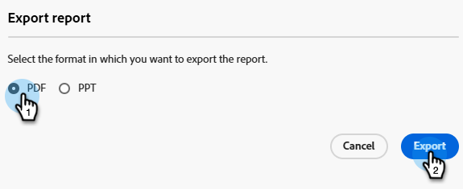

>[!TAB Within the report]

1. Within the report itself, click the 'more' icon (**...**) on the upper-right and select **Export**. 

   

1. Choose PDF or PPT and click **Export**.

   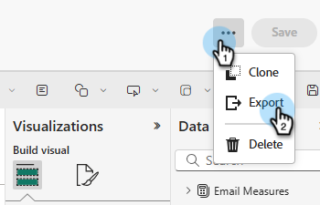

>[!ENDTABS]

### Export a visualization {#export-a-visualization}

Learn how to export specifc sections of your report.

1. Choose the desired report. 

   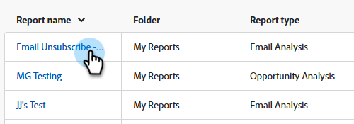{width="600" zoomable="yes"}

1. Hover over the displayed visualization to reveal three icons. 

   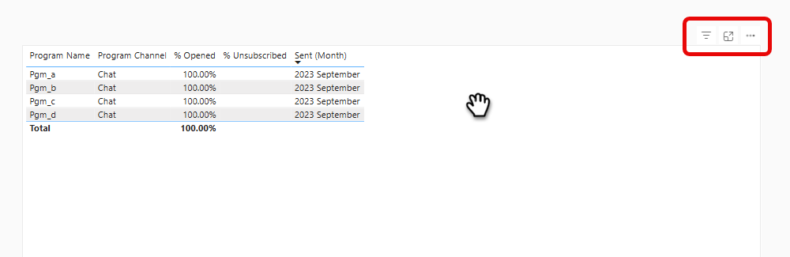{width="600" zoomable="yes"}

1. Click the 'more' icon (**...**) 

   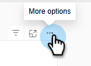

1. Select **Export data**.

   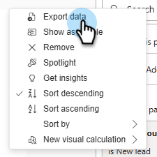

1. Choose your desired data format. 

   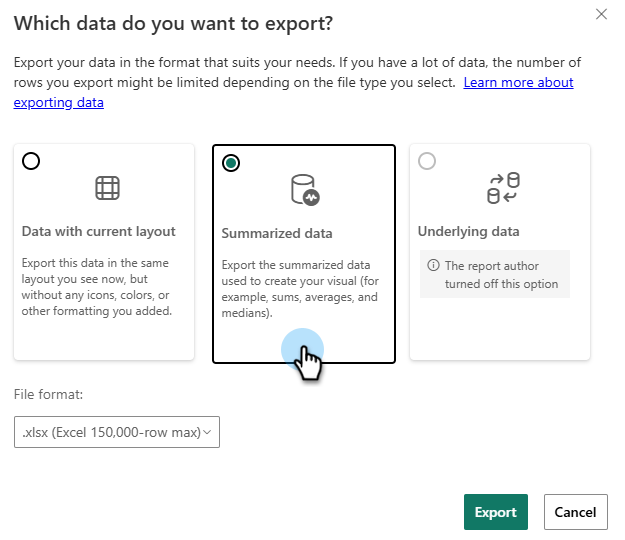

   >[!NOTE]
   >
   >* _Data with current layout_ is only available for table and matrix visuals.
   >* _Underlying data_ is not available in Marketo Engage.

1. Choose the desired file format (.XLS, .CSV).

   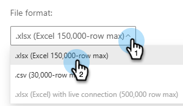

1. Click **Export**.

## Video demo {#video}

Watch the following video to see an example of a multi-page, drill-through report experience.

>[!VIDEO](https://video.tv.adobe.com/v/3451681/?quality=12&learn=on){transcript=true}

## Standard reports in Advanced BI Analytics {#standard-reports}

The following standard reports are included as examples for your custom reports.

<table>
  <thead>
    <tr>
      <th>Reporting Area</th>
      <th>Report Name</th>
    </tr>
  </thead>
  <tbody>
    <tr>
      <td rowspan="8">Email Analysis</td>
      <td>Email - Sent Activity (in CST)</td>
    </tr>
    <tr>
      <td>Email - Click Activity (in CST)</td>
    </tr>
    <tr>
      <td>Email - Open Activity (in CST)</td>
    </tr>
    <tr>
      <td>Email - Clicked Time Distribution (in CST)</td>
    </tr>
    <tr>
      <td>Email - Open Rate Decay</td>
    </tr>
    <tr>
      <td>Email - Opened Time Distribution (in CST)</td>
    </tr>
    <tr>
      <td>Email - Performance Details</td>
    </tr>
    <tr>
      <td>Email - Click Rate Decay</td>
    </tr>
    <tr>
      <td rowspan="8">Lead Analysis</td>
      <td>Top 10 Lead Sources By Converted Leads</td>
    </tr>
    <tr>
      <td>Top 10 Lead Sources</td>
    </tr>
    <tr>
      <td>SLA Infractions Report</td>
    </tr>
    <tr>
      <td>Lead Aging Report</td>
    </tr>
    <tr>
      <td>Lead Balance Report</td>
    </tr>
    <tr>
      <td>Lead Conversion Report</td>
    </tr>
    <tr>
      <td>Lead Flow Report</td>
    </tr>
    <tr>
      <td>Lead Transition Time Report</td>
    </tr>
    <tr>
      <td rowspan="5">Program Analysis</td>
      <td>Top 10 Programs By Success</td>
    </tr>
    <tr>
      <td>Top 10 Programs By Total Pipeline</td>
    </tr>
    <tr>
      <td>Program Revenue Stage Report</td>
    </tr>
    <tr>
      <td>Top 10 Acquisition Programs</td>
    </tr>
    <tr>
      <td>Marketing Channel Investment Trend</td>
    </tr>
    <tr>
      <td rowspan="7">Opportunity Analysis</td>
      <td>Marketing Impact on Closed Opportunities</td>
    </tr>
    <tr>
      <td>Marketing Influence on Opportunities Closed Won</td>
    </tr>
    <tr>
      <td>Marketing Influence on Opportunities Created</td>
    </tr>
    <tr>
      <td>(FT) Marketing Influence on Opportunities Created</td>
    </tr>
    <tr>
      <td>(MT) Marketing Influence on Opportunities Closed Won</td>
    </tr>
    <tr>
      <td>(MT) Marketing Influence on Opportunities Created</td>
    </tr>
    <tr>
      <td>(FT) Marketing Influence on Opportunities Closed Won</td>
    </tr>
    <tr>
      <td>Opportunity Lead Analysis</td>
      <td>Top 10 Lead Owners By Opportunities Won</td>
    </tr>
  </tbody>
</table>

## Things to note {#note}

* The classic "Revenue Explorer" experience will be permanently deprecated on June 10, 2025. In the meantime, you can access, create, update, and delete reports in both experiences.

* Your custom reports will be replicated from the classic experience to the new experience with the notable behavior changes mentioned in the [Learning the New Experience](#learning-the-new-experience) section below.

   >[!IMPORTANT]
   >
   >Replication of custom reports will be carried out in groups. Once your custom reports are replicated to the new experience, to ensure consistency between the two experiences, any changes made in the classic experience will also need to be manually applied to the corresponding reports in the new experience. An information note on the above will light up in the classic experience upon the replication of your customer reports.

   * Dashboards in the classic experience are not transferable and will require recreation in the new experience. They should be recreated as reports in the new experience and the filters in the new experience automatically pulls possible values rather than requiring you to manually enter all possible values individually in the classic experience.
      
      >[!NOTE]
      >
      >The dashboard in the new experience is simply a collection of reports on a single page. The primary value of dashboard in the new experience is to allow you to present analytical insights across different reporting areas.

* Your email subscriptions in the classic experience will be replicated to the new experience. The email subscriptions in the classic experience will continue functioning until the deprecation of the classic experience on June 10, 2025.

* Existing Revenue Explorer users automatically have access to the new Advanced BI Analytics experience.

* You can create up to 700 reports in Advanced BI Analytics.

* There is a limitation of 1 million rows per query on any given visualization. If your query exceeds that, you will receieve the following error: `The resultset of a query to external data source has exceeded the maximum allowed size of '1000000' rows`. To fix this, reduce your date range, and/or adjust the filters in your report to reduce the number of rows in your query result.

## Learning the new experience {#learning-the-new-experience} 

The new visualization experience is delivered via embedded Power BI service.

For a quick tutorial on the visualization experience, visit Microsoft's [Use visuals in Power BI](https://learn.microsoft.com/en-us/training/modules/visuals-in-power-bi/){target="_blank"} documentation. Please note that you may not see all of those features in Marketo Engage.

### Notable experience changes {#notable-experience-changes}

The following are changes in the new experience (Advanced BI Analytics) from the classic experience (Revenue Explorer/Advanced Report Builder).

* The date-type filter functions equivalently; however, the syntax for specifying values changed. In your existing custom reports, all date-type filter values&mdash;except for "Day of the Week"&mdash;are automatically converted to their corresponding equivalents in the new experience. Support for "Day of the Week" values has been discontinued.

* The string-type filters are now case-sensitive.

* Runtime formula field in the classic experience is no longer supported.

* Email subscription includes the PDF export rather than the HTML of the report. The new email subscription will not include the report definition.

* Deep link of report is not supported at this time.

* PDF export is synchronous in the new experience, compared to being asynchronous in the classic experience.

>[!NOTE]
>
>You cannot include more than one Custom Field Group field in a visual for Model Performance Analysis (Leads) reporting area.

>[!MORELIKETHIS]
>
>[Metrics and Dimensions](/help/marketo/product-docs/reporting/advanced-bi-analytics/metrics-and-dimensions.md){target="_blank"}
