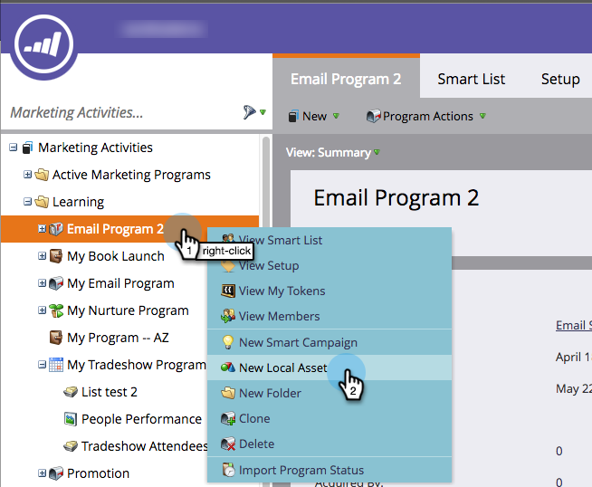
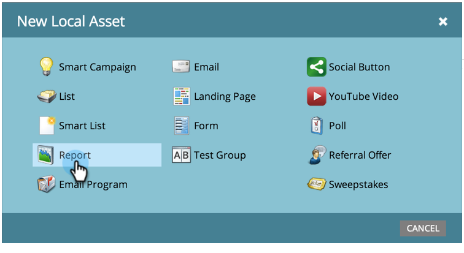
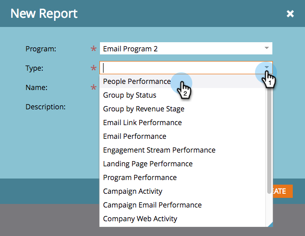
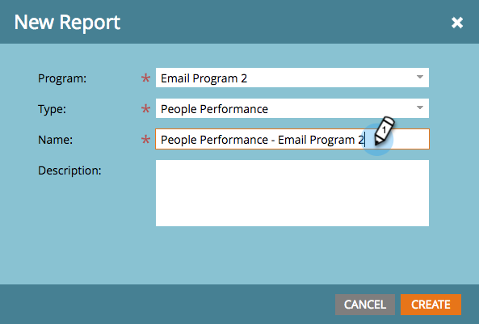

# Create a Report in a Program {#create-a-report-in-a-program}

Run a report to analyze people, your programs, landing pages, emails, and social assets.

1. Go to **Marketing Activities**.

   

1. Select a program.

   

   >[!NOTE]
   >
   >You can also create reports from the **Analytics** tab.

1. Right-click the program and select **New Local Asset**.

   

1. Click **Report**.

   

1. Select the report **Type**.

   

   >[!TIP]
   >
   >See [Report Type Overview](https://docs.marketo.com/display/DOCS/Report+Type+Overview) for a short description of each.

1. Name your report.

   

   >[!TIP]
   >
   >To make navigating your reports later much easier, include a reference to the report type in the name.

1. Set the time frame of your report. See [Change a Report Time Frame](/help/marketo/product-docs/reporting/basic-reporting/editing-reports/change-a-report-time-frame.md) for more details.

1. Click the **Report** tab to see your statistics.

   

   >[!NOTE]
   >
   >By default, reports cover all the activity in your account, across programs.

   >[!NOTE]
   >
   >You can quickly end up with a lot of reports. Remember to [delete a report](/help/marketo/product-docs/reporting/basic-reporting/report-activity/delete-a-report.md) you no longer need.

   >[!MORELIKETHIS]
   >
   >You can [change a report time frame](/help/marketo/product-docs/reporting/basic-reporting/editing-reports/change-a-report-time-frame.md), [subscribe to a basic report](/help/marketo/product-docs/reporting/basic-reporting/report-subscriptions/subscribe-to-a-basic-report.md), [export a report to Excel](/help/marketo/product-docs/reporting/basic-reporting/report-activity/export-a-report-to-excel.md), [filter people in a report with a smart list](/help/marketo/product-docs/reporting/basic-reporting/editing-reports/filter-people-in-a-report-with-a-smart-list.md), and more.
