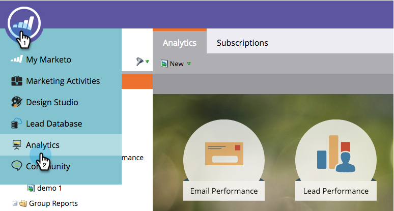
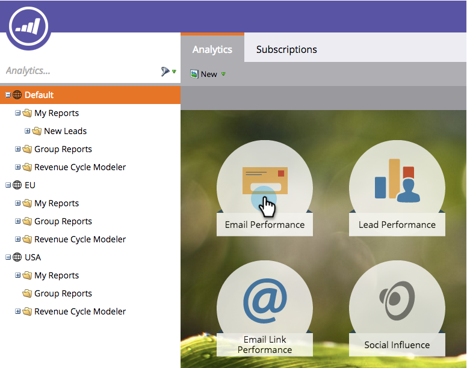
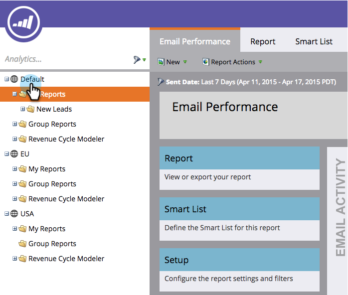

# Navigating the Analytics Home Page {#navigating-the-analytics-home-page}

1. Go to the **Analytics** area.
1. 

1. Select a [report type](../../../../product-docs/reporting/basic-reporting/report-types/report-type-overview.md).
1. 

1. Once you've run your report, click on the workspace to go back to the **Analytics Home**.

   

   Great! You know how to navigate through the Analytics Home!

>[!MORELIKETHIS]
>
>[Understanding My Reports and Group Reports](understanding-my-reports-and-group-reports.md)

