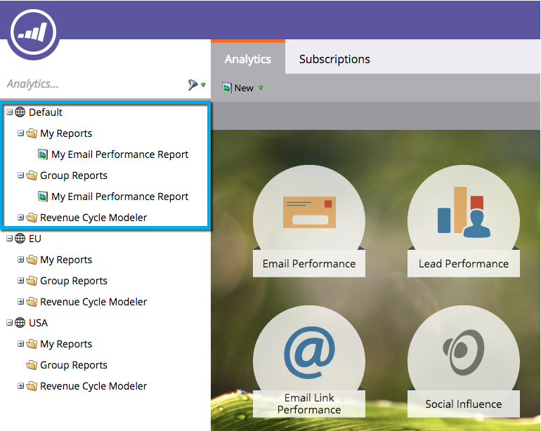

# Understanding My Reports and Group Reports {#understanding-my-reports-and-group-reports}

You can create **My Reports** and **Group Reports** from the [Analytics Home](/help/marketo/product-docs/reporting/basic-reporting/creating-reports/navigating-the-analytics-home-page.md).

**My Reports** are only visible to you.

**Group Reports** are visible to all users in that workspace.

>[!NOTE]
>
>Each workspace has a set of **My Reports** and **Group Reports**.

>[!MORELIKETHIS]
>
>* [Save a Report](/help/marketo/product-docs/reporting/basic-reporting/creating-reports/save-a-report.md)
>* [Clone a Report to Group Reports](/help/marketo/product-docs/reporting/basic-reporting/report-activity/clone-a-report-to-group-reports.md)
