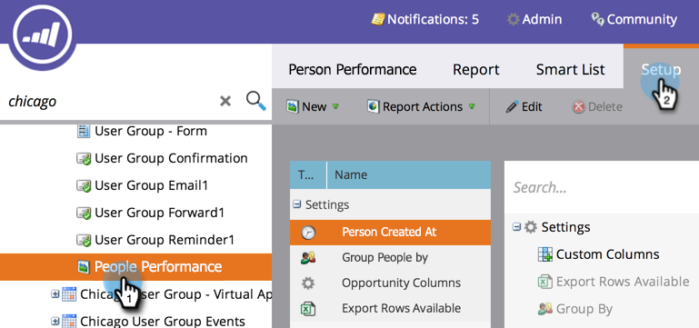
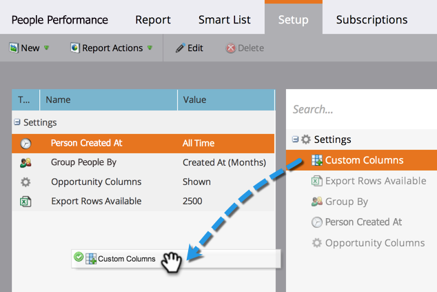
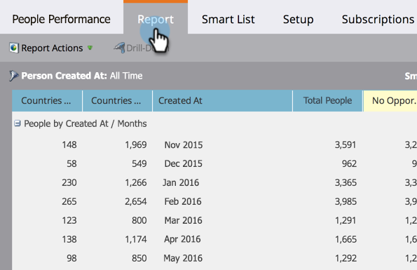

# Add Custom Columns to a Person Report {#add-custom-columns-to-a-person-report}

You can further filter the metrics in your person reports by using your [smart lists](/help/marketo/product-docs/core-marketo-concepts/smart-lists-and-static-lists/understanding-smart-lists.md) as custom columns.

1. Go to the **[!UICONTROL Marketing Activities]** (or **[!UICONTROL Analytics]**) area.

   

1. Select your report and click the **[!UICONTROL Setup]** tab.

   

1. Drag over **[!UICONTROL Custom Columns]**.

   

1. Select the smart lists to use as report columns.

   

1. You've done it! Click the **[!UICONTROL Report]** tab to see your report with the new columns.

   

   >[!MORELIKETHIS]
   >
   >You can also [Add Opportunity Columns to a Lead Report](/help/marketo/product-docs/reporting/basic-reporting/editing-reports/add-opportunity-columns-to-a-lead-report.md).
