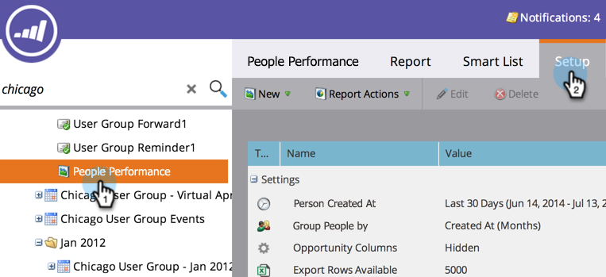
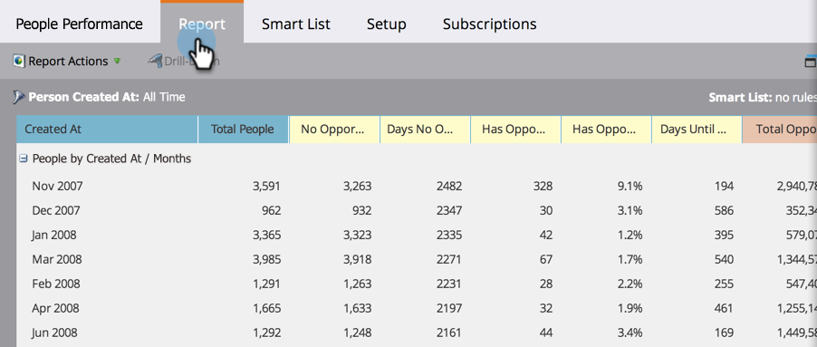
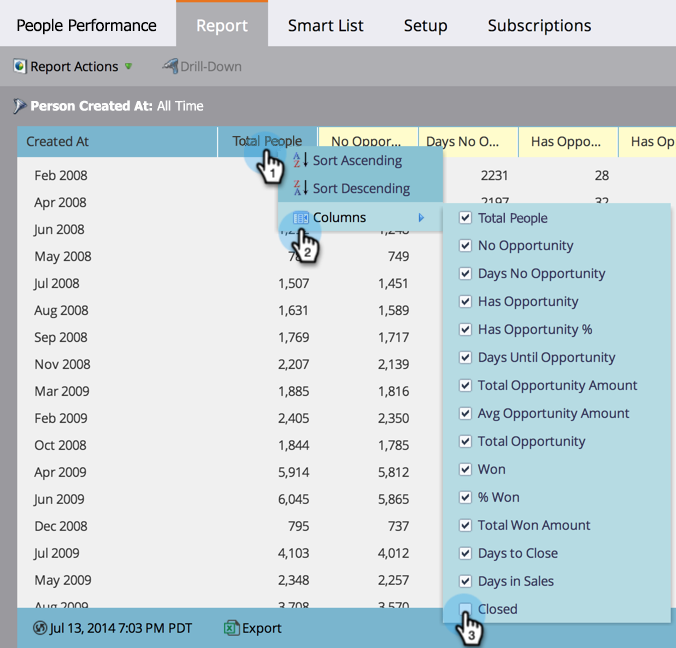

# Add Opportunity Columns to a Lead Report {#add-opportunity-columns-to-a-lead-report}

To see the statistics on opportunities in your person reports, you can add opportunity columns.

1. Go to the **Marketing Activities** area.

   

1. Select your report from the navigation tree and click the **Setup** tab.

   

1. Double-click **Opportunity Columns**.

   

1. Select **Shown** from the drop-down menu.

   

1. Click the **Report** tab to see your report with opportunity metrics.

   

   >[!TIP]
   >
   >Scroll right to see more columns.

1. To [add or remove columns from the report](/help/marketo/product-docs/reporting/basic-reporting/editing-reports/select-report-columns.md), click any column heading and select **Columns**.

   

   The available opportunity columns are:

   >[!NOTE]
   >
   >Each opportunity is counted only once, based on the primary contact assigned to it.

   | Column |Description |
   |---|---|
   | No Opportunity |Number of people who are *not* a primary opportunity contact. |
   | Days No Opportunity |Average age, in days, of people who are *not* a primary contact. |
   | Has Opportunity |Number of people who are a primary opportunity contact. |
   | Has Opportunity % |Percentage of people who are a primary opportunity contact. |
   | Days Until Opportunity |Average number of days for conversion from person to primary opportunity contact. |
   | Total Opportunity Amount |Sum of all opportunity amounts. |
   | Avg Opportunity Amount |Sum of opportunity amounts, divided by the number of opportunities. |
   | Total Opportunity |Number of all opportunities. |
   | Closed |Number of opportunities that have been closed, won or lost. |
   | Won |Number of opportunities that have been won. |
   | % Won |Percentage of opportunities that have been won. |
   | Total Won Amount |Sum of won opportunity amounts. |
   | Days to Close |Average number of days to close opportunities. |
   | Days in Sales |Average length of the sales cycle (Days Until Opportunity + Days to Close). |

   >[!MORELIKETHIS]
   >
   >Learn how to [manage the size of your report](/help/marketo/product-docs/reporting/basic-reporting/editing-reports/configure-report-size.md).
