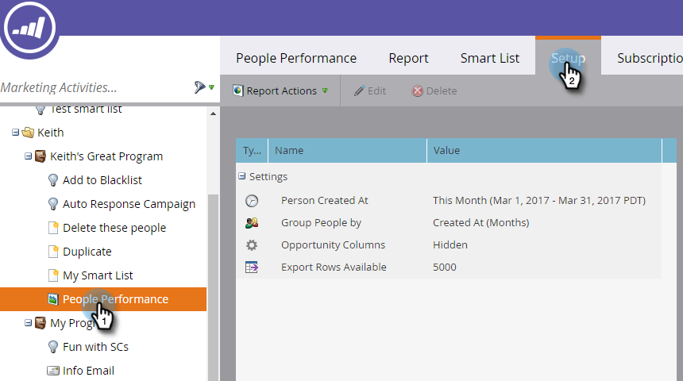
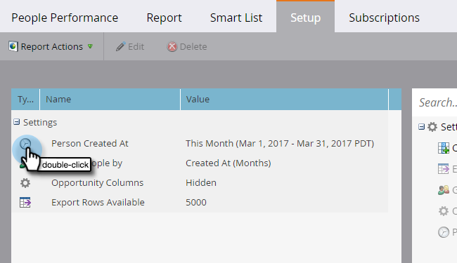
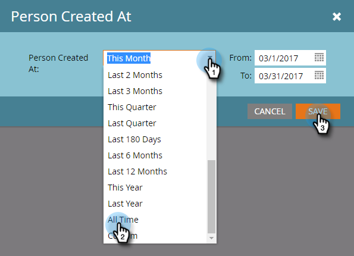

# Change a Report Time Frame {#change-a-report-time-frame}

Change the time period covered by your report, to focus on a specific time of activity.

1. Go to the **Marketing Activities** (or **Analytics**) area.

   

1. Select your report from the navigation tree and click the **Setup** tab.

   

1. Double-click the time frame field, labeled differently depending on report type:

    * **Person Created At**, in person reports
    * **Sent Date**, in email reports
    * **Date of Activity**, in all other reports

   

   >[!NOTE]
   >
   >**Person Created At** refers to the moment the person became known in your database.

1. Choose the appropriate time frame from the drop-down menu.

   

   >[!TIP]
   >
   >To set specific dates, select **Custom** from the drop-down menu and enter the dates in the **From** and **To** calendar fields.

   Click the **Report** tab to see your report for the selected time frame.  
   

   >[!MORELIKETHIS]
   >
   >To narrow your report by specific person attributes, you can [Filter People in a Report with a Smart List](/help/marketo/product-docs/reporting/basic-reporting/editing-reports/filter-people-in-a-report-with-a-smart-list.md).
