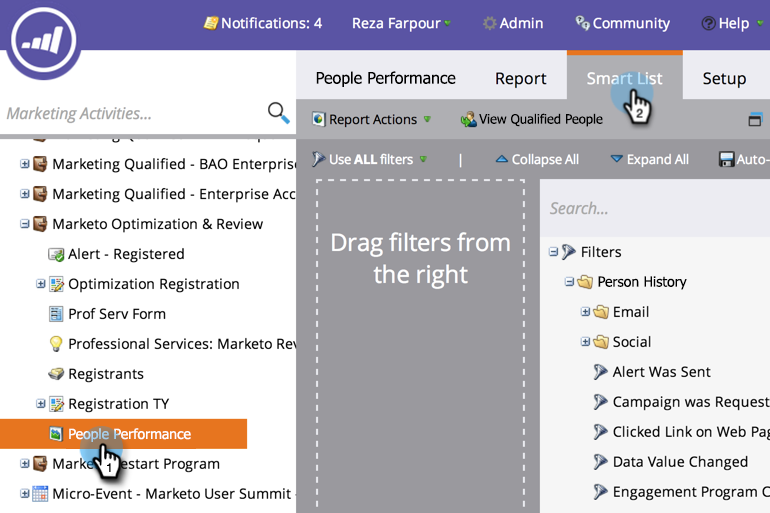

# Filter People in a Report with a Smart List {#filter-people-in-a-report-with-a-smart-list}

Use smart lists to filter your reports by specific person attributes.

>[!NOTE]
>
>**FYI**
>
>Marketo is now standardizing language across all subscriptions, so you may see lead/leads in your subscription and person/people in docs.marketo.com. These terms mean the same thing; it does not affect article instructions. There are some other changes, too. [Learn more](http://docs.marketo.com/display/DOCS/Updates+to+Marketo+Terminology).

You can use smart lists with these report types:

* [People Performance](../../../../product-docs/reporting/basic-reporting/report-types/people-performance-report.md)
* [People by Status](../../../../product-docs/reporting/basic-reporting/report-types/people-by-status-report.md)
* [People by Revenue Stage](http://docs.marketo.com/display/DOCS/People+by+Revenue+Stage+Report)
* [Email Performance](../../../../product-docs/email-marketing/email-programs/email-program-data/email-performance-report.md)
* [Email Link Performance](../../../../product-docs/email-marketing/email-programs/email-program-data/email-link-performance-report.md)
* [Engagement Stream Performance](../../../../product-docs/email-marketing/drip-nurturing/reports-and-notifications/engagement-stream-performance-report.md)
* [Campaign Activity](../../../../product-docs/reporting/basic-reporting/report-types/campaign-activity-report.md)
* [Campaign Email Performance](../../../../product-docs/reporting/basic-reporting/report-types/campaign-email-performance-report.md)
* [Company Web Activity](../../../../product-docs/reporting/basic-reporting/report-types/company-web-activity-report.md)
* [Web Page Activity](../../../../product-docs/reporting/basic-reporting/report-types/web-page-activity-report.md)

1. Go to the **Marketing Activities** area.

   

1. Select your report from the navigation tree and click the **Smart List** tab.

   

1. Find the appropriate filter, and drag it over.

   

1. Configure the filter.

   

1. Click the **Report** tab to see your filtered report.

   

   Great! Now your report shows you data for just the people that match the smart list.

   >[!NOTE]
   >
   >**Deep Dive**
   >
   >
   >For more ways to use reports, see the [Basic Reporting](http://docs.marketo.com/display/docs/basic+reporting) deep dive.

