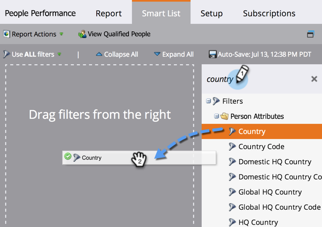

# Filter People in a Report with a Smart List {#filter-people-in-a-report-with-a-smart-list}

Use smart lists to filter your reports by specific person attributes.

You can use smart lists with these report types:

* [People Performance](/help/marketo/product-docs/reporting/basic-reporting/report-types/people-performance-report.md)
* [People by Status](/help/marketo/product-docs/reporting/basic-reporting/report-types/people-by-status-report.md)
* [Email Performance](/help/marketo/product-docs/email-marketing/email-programs/email-program-data/email-performance-report.md)
* [Email Link Performance](/help/marketo/product-docs/email-marketing/email-programs/email-program-data/email-link-performance-report.md)
* [Engagement Stream Performance](/help/marketo/product-docs/email-marketing/drip-nurturing/reports-and-notifications/engagement-stream-performance-report.md)
* [Campaign Email Performance](/help/marketo/product-docs/reporting/basic-reporting/report-types/campaign-email-performance-report.md)
* [Company Web Activity](/help/marketo/product-docs/reporting/basic-reporting/report-types/company-web-activity-report.md)
* [Web Page Activity](/help/marketo/product-docs/reporting/basic-reporting/report-types/web-page-activity-report.md)

1. Go to the **[!UICONTROL Marketing Activities]** area.

   

1. Select your report from the navigation tree and click the **[!UICONTROL Smart List]** tab.

   

1. Find the appropriate filter, and drag it over.

   

1. Configure the filter.

   

1. Click the **[!UICONTROL Report]** tab to see your filtered report.

   

   Great! Now your report shows you data for just the people that match the smart list.
