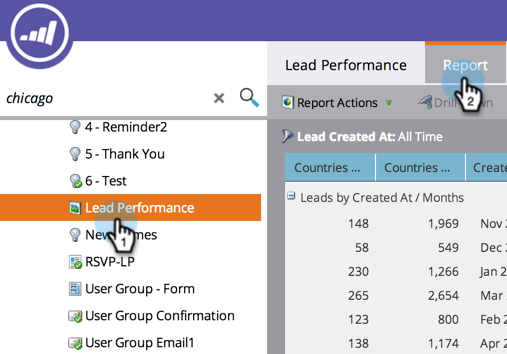
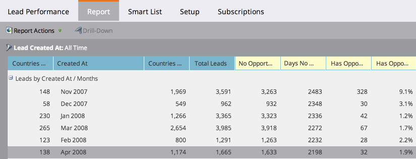

# Reorder Report Columns {#reorder-report-columns}

You can change the order of the columns in a report.

1. Go to the **Marketing Activities** (or **Analytics**) area.

   

1. Select your report from the navigation tree, and click the **Report** tab.

   

1. Click and hold the column to drag it to the new position, then release the mouse button.

   

1. That's it! The columns now appear in the new order.

   

   You can repeat these steps until the columns appear in the order that works best for you.  

   >[!MORELIKETHIS]
   >
   >
   >    
   >    
   >    * [Select Report Columns](select-report-columns.md)
   >    
   >

   >[!NOTE]
   >
   >**Deep Dive**
   >
   >
   >Learn all the power of working with reports in [Basic Reporting](http://docs.marketo.com/display/docs/basic+reporting).

