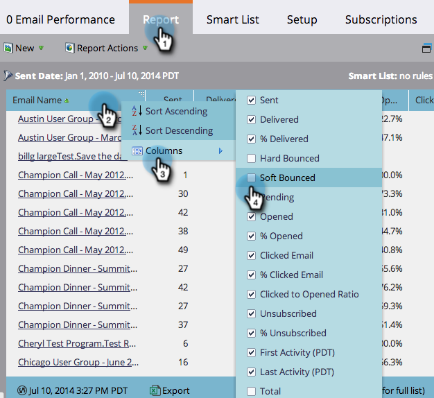

# Select Report Columns {#select-report-columns}

You can choose which columns are and are not included in your report.

1. Go to the **Analytics **(or **Marketing Activities**) area.

   

1. Select your report.

   

1. Click the **Report** tab, then click any column heading and select **Columns**, and then choose the columns to include.

   

   >[!NOTE]
   >
   >**Related Articles**
   >
   >    
   >    
   >    * [Sort Report on Columns](sort-report-on-columns.md)
   >    
   >

   Do more with reports! See&nbsp; [Basic Reporting](http://docs.marketo.com/display/docs/basic+reporting).

