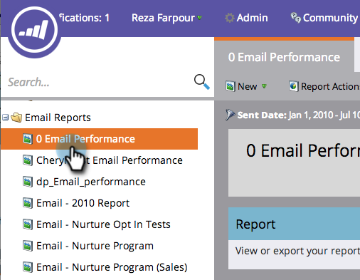

# Select Report Columns {#select-report-columns}

You can choose which columns are and are not included in your report.

1. Go to the **[!UICONTROL Analytics]** (or **[!UICONTROL Marketing Activities]**) area.

   

1. Select your report.

   

1. Click the **[!UICONTROL Report]** tab, then click any column heading and select **[!UICONTROL Columns]**, and then choose the columns to include.

   

   >[!MORELIKETHIS]
   >
   >[Sort Report on Columns](/help/marketo/product-docs/reporting/basic-reporting/editing-reports/sort-report-on-columns.md)
