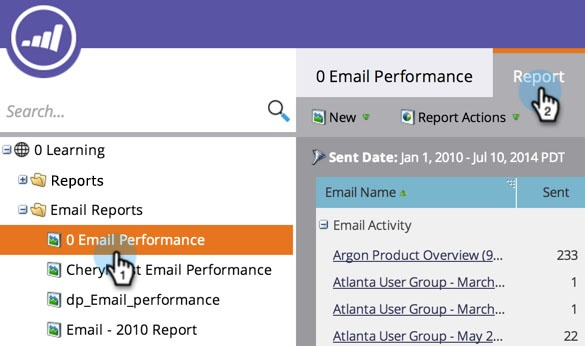
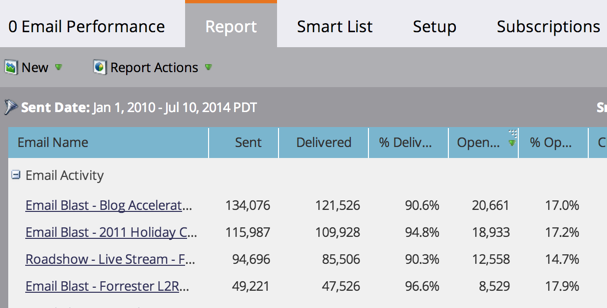

# Sort Report on Columns {#sort-report-on-columns}

Use columns to sort the data in your report and make the most important figures easy to find.

1. Go to **Analytics** (or **Marketing Activities**).

   

1. Select your report from the navigation tree, and click the **Report** tab.

   

1. Click the most important column and select a sort order.

   

1. Great! Now you can focus on the most interesting data in your report.

   

   >[!MORELIKETHIS]
   >
   >[Select Report Columns](/help/marketo/product-docs/reporting/basic-reporting/editing-reports/select-report-columns.md)
