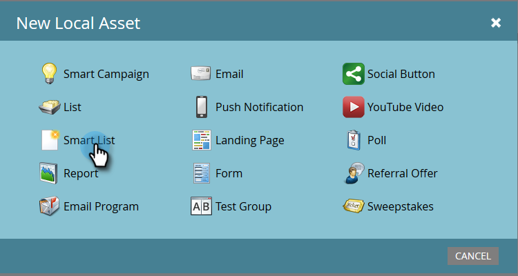
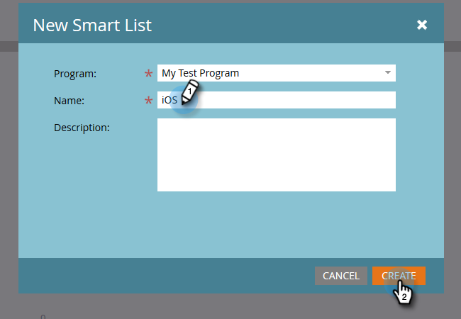
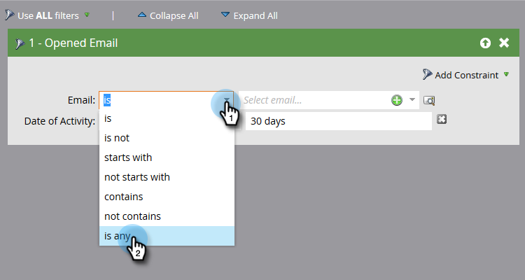
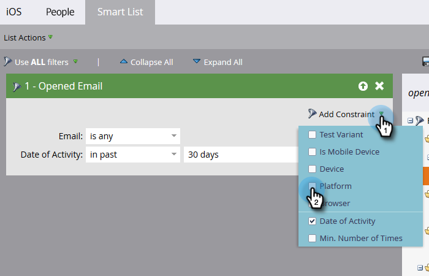
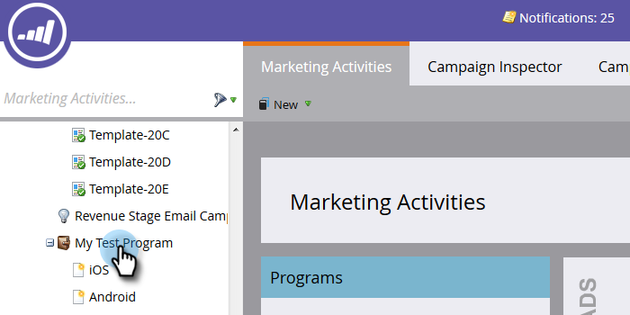
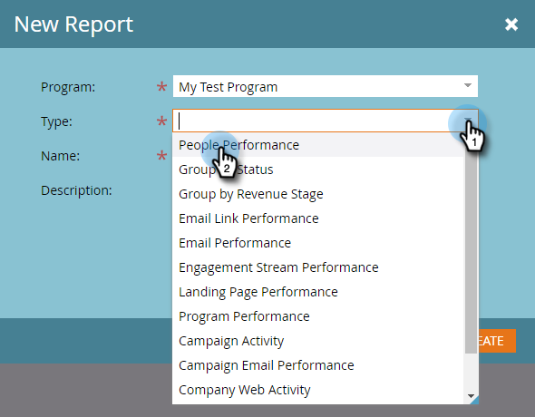
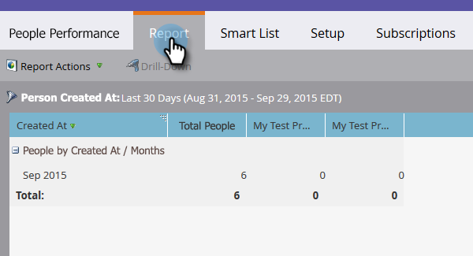

# Build a People Performance Report with Mobile Platform Columns {#build-a-people-performance-report-with-mobile-platform-columns}

Follow these steps to create a People Performance Report with mobile platform (iOS/Android) columns.

## Create Mobile Smart Lists {#create-mobile-smart-lists}

1. Go to **[!UICONTROL Marketing Activities]**.

   

1. Choose a program.

   

1. Under **[!UICONTROL New]**, select **[!UICONTROL New Local Asset]**.

   

1. Click **[!UICONTROL Smart List]**.

   

1. Type in a name and click **[!UICONTROL Create]**.

   

1. Find and drag the [!UICONTROL Opened Email] filter into the canvas.

   

1. Set Email to **[!UICONTROL is any]**.

   

1. Click on **[!UICONTROL Add Constraint]** and select **[!UICONTROL Platform]**.

   

   >[!TIP]
   >
   >We used the [!UICONTROL Opened Email] filter in this example. You can also use the [!UICONTROL Clicked Email] filter as it has the Platform constraint.

1. Set [!UICONTROL Platform] to **[!UICONTROL iOS]**.

   

   >[!NOTE]
   >
   >At least one person must have opened one of your emails on an iOS device in order for Marketo's autosuggest to find it. If it does not come up, you can manually type it in and save.

   Now create a second smart list for the "Android" platform. Once that's done, move on to the next section.

## Create a People Performance Report {#create-a-people-performance-report}

1. Under Marketing Activities, select the program that is housing your **[!UICONTROL iOS]** and **[!UICONTROL Android]** smart lists.

   

1. Under **[!UICONTROL New]**, select **[!UICONTROL New Local Asset]**.

   

1. Click **[!UICONTROL Report]**.

   

1. Set Type to **[!UICONTROL People Performance]**.

   

1. Click **[!UICONTROL Create]**.

   

   You're doing great! Now on to the next section.

## Add Mobile Smart Lists as Columns {#add-mobile-smart-lists-as-columns}

1. In the report you just created, click **[!UICONTROL Setup]**, then drag **[!UICONTROL Custom Columns]** into the canvas.

   

   >[!NOTE]
   >
   >By default the People Performance report is looking at the Last 7 days. You can change the timeframe by double-clicking on it.

1. Find and select the smart lists you created earlier and click **[!UICONTROL Apply]**.

   

1. Click **[!UICONTROL Report]** to run the report and see your data.

   

   Pretty cool, right? Nicely done!
