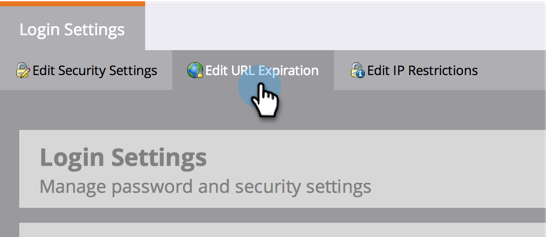

# Change the Expiration Time for URLS in Report Emails {#change-the-expiration-time-for-urls-in-report-emails}

>[!NOTE]
>
>**Admin Permissions Required**

Links in your report subscription emails expire after three days. In order to change the expiration time for these links, follow these steps.

1. Under **Admin**, click on **Login Settings**.

   

1. Click on the **Edit URL Expiration **button.

   

1. Select from the drop-down menu how many days before the link expires. Click **Save**.

   

   Cool, you have edited your email link expiration settings.

   >[!NOTE]
   >
   >**Reminder**
   >
   >
   >Remember, these only apply to links in reports and alerts, not marketing emails.

