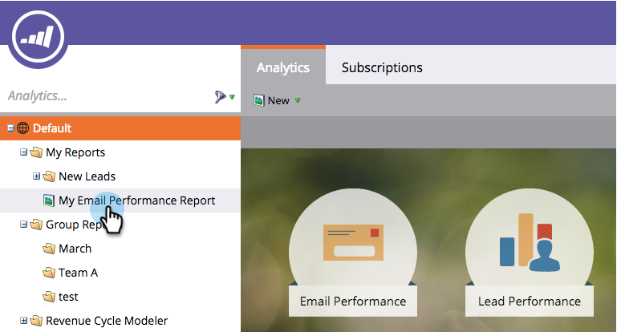
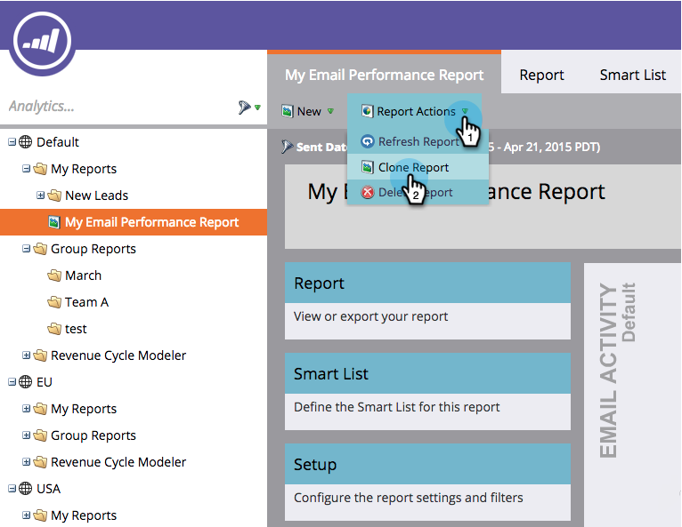
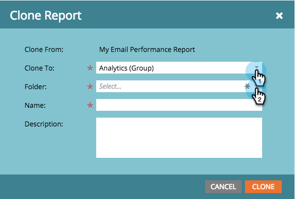
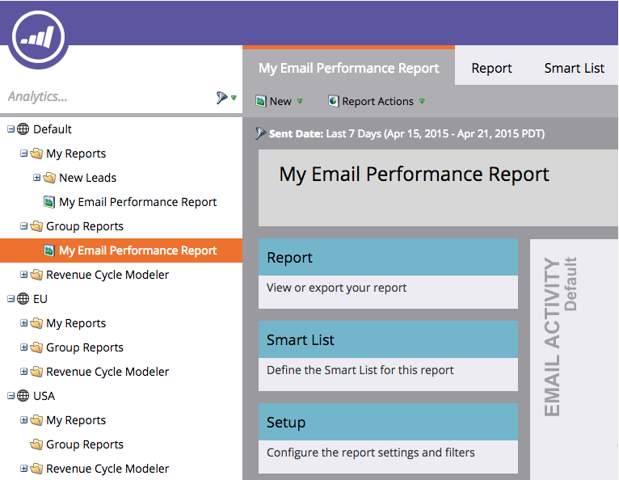

# Clone a Report to Group Reports {#clone-a-report-to-group-reports}

Any report in **[!UICONTROL My Reports]** is only visible to you. What if you wanted to make the report accessible all others? Here's how you can do that:

1. In the **[!UICONTROL Analytics]** area, click on the desired [saved report](/help/marketo/product-docs/reporting/basic-reporting/creating-reports/save-a-report.md).

   

   >[!NOTE]
   >
   >Alternatively, a saved report can be cloned to **[!UICONTROL Group Reports]** by dragging the report into the folder.

1. Click **[!UICONTROL Report Actions]** and select **[!UICONTROL Clone Report]**.

   

1. Click the **[!UICONTROL Clone To]** drop-down and select your group. Select the **[!UICONTROL Folder]**.

   

1. **[!UICONTROL Name]** the report and click **[!UICONTROL Clone]**.

   

   Cool! Your report will now appear in **[!UICONTROL Group Reports]**.

   
