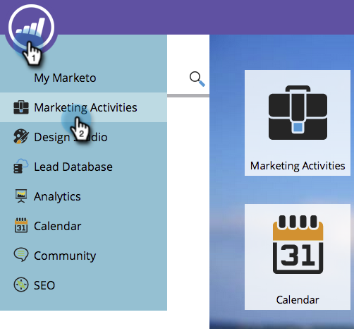
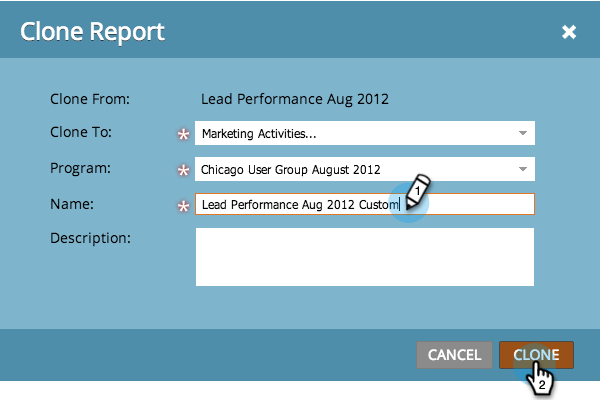

# Clone a Report {#clone-a-report}

Create a duplicate of your report to customize it further without changing the original.

1. Go to **[!UICONTROL Marketing Activities]** (or **[!UICONTROL Analytics]**) area.

   

1. Select your report. Select **[!UICONTROL Report Actions]** > **[!UICONTROL Clone a Report]**.

   

   >[!TIP]
   >
   >You can also clone a report by right-clicking it in the tree.

1. Name your report clone.

   

   That's it - you're ready to start customizing your clone!

   >[!MORELIKETHIS]
   >
   >[Filter People in a Report with a Smart List](/help/marketo/product-docs/reporting/basic-reporting/editing-reports/filter-people-in-a-report-with-a-smart-list.md)
