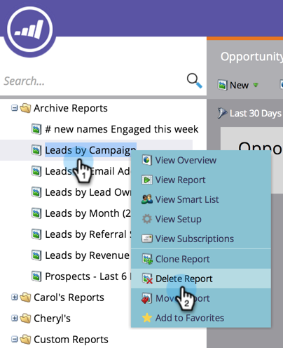

# Delete a Report {#delete-a-report}

Once you start [creating reports](../../../../product-docs/reporting/basic-reporting/creating-reports/create-a-report-in-a-program.md), you can quickly end up with a lot of them. Remember to delete reports you no longer need.

1. Right-click the unneeded report in the tree and select **Delete Report**.

   

1. Confirm your intention to delete the report.

   

   The report disappears from the tree. Go ahead, remove some more old reports now!

   >[!NOTE]
   >
   >**Deep Dive**
   >
   >
   >See all the other things you can do with reports in the  [Basic Reporting](http://docs.marketo.com/display/docs/basic+reporting) deep dive.

