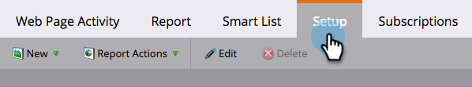
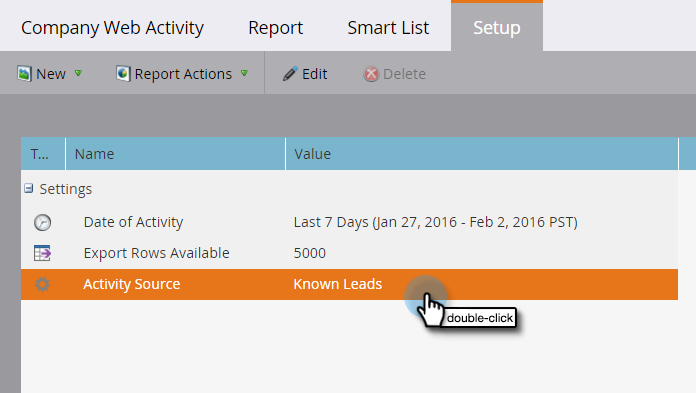
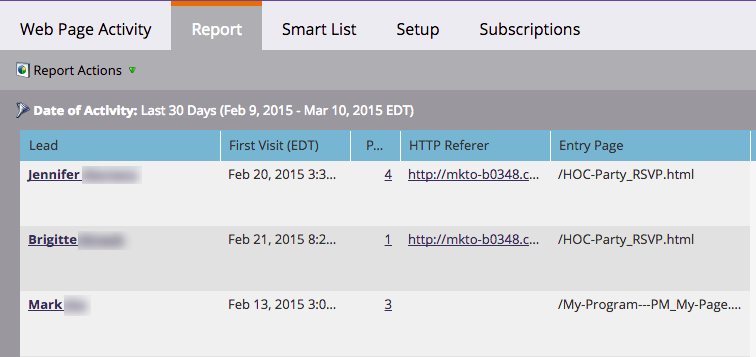

# Display People or Anonymous Visitors in Web Reports {#display-people-or-anonymous-visitors-in-web-reports}

>[!PREREQUISITES]
>
>[Add Munchkin Tracking Code to Your Website](../../../../product-docs/administration/additional-integrations/add-munchkin-tracking-code-to-your-website.md)

In the [Web Page Activity](../../../../product-docs/reporting/basic-reporting/report-types/web-page-activity-report.md) and  [Company Web Activity reports](../../../../product-docs/reporting/basic-reporting/report-types/company-web-activity-report.md) you can see either [people or anonymous visitors](../../../../product-docs/core-marketo-concepts/smart-lists-and-static-lists/managing-people-in-smart-lists/understanding-anonymous-activity-and-people.md) who visit your site. The anonymous visitors have inferred data, such as Metro Area.  Here's how to select whether the report displays known leads or anonymous visitors.

1. In your Web Page Activity report, click **Setup**.

   

1. Double-click **Activity Source**.

   

1. In the popup, select **Known Leads **(people) or** Anonymous Visitors **from the drop-down.

   

   >[!NOTE]
   >
   >Including ISPs for anonymous visitors generates a longer report, but excluding them provides a clearer view of where your visitors are coming from besides the standard sources, such as Google.

1. That's it. Click the **Report** tab to go back and view your report with known or anonymous people.

   

>[!MORELIKETHIS]
>
>* [Tracking Anonymous Activity and People](tracking-anonymous-activity-and-people.md)
>

