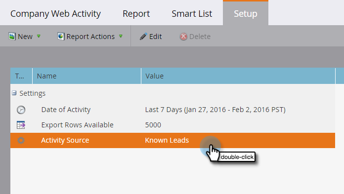
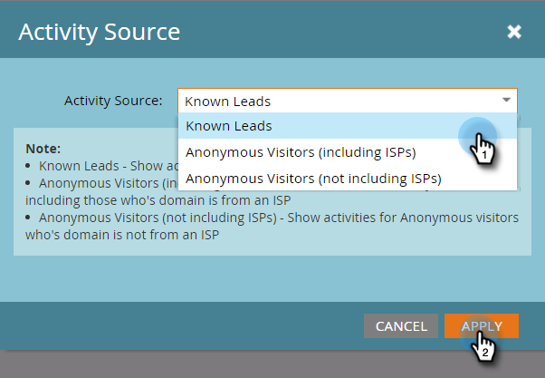

# Display People or Anonymous Visitors in Web Reports {#display-people-or-anonymous-visitors-in-web-reports}

>[!PREREQUISITES]
>
>[Add Munchkin Tracking Code to Your Website](/help/marketo/product-docs/administration/additional-integrations/add-munchkin-tracking-code-to-your-website.md)

In the [[!UICONTROL Web Page Activity]](/help/marketo/product-docs/reporting/basic-reporting/report-types/web-page-activity-report.md) and  [[!UICONTROL Company Web Activity] reports](/help/marketo/product-docs/reporting/basic-reporting/report-types/company-web-activity-report.md) you can see either [people or anonymous visitors](/help/marketo/product-docs/core-marketo-concepts/smart-lists-and-static-lists/managing-people-in-smart-lists/understanding-anonymous-activity-and-people.md) who visit your site. The anonymous visitors have inferred data, such as Metro Area.  Here's how to select whether the report displays known leads or anonymous visitors.

1. In your [!UICONTROL Web Page Activity] report, click **[!UICONTROL Setup]**.

   

1. Double-click **[!UICONTROL Activity Source]**.

   

1. In the popup, select **[!UICONTROL Known Leads]** (people) or **Anonymous Visitors** from the drop-down.

   

   >[!NOTE]
   >
   >Including ISPs for anonymous visitors generates a longer report, but excluding them provides a clearer view of where your visitors are coming from besides the standard sources, such as Google.

1. Click the **[!UICONTROL Report]** tab to go back and view your report with known or anonymous people.

   

>[!MORELIKETHIS]
>
>[Tracking Anonymous Activity and People](/help/marketo/product-docs/reporting/basic-reporting/report-activity/tracking-anonymous-activity-and-people.md)
