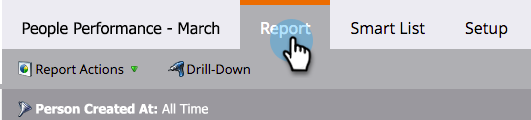
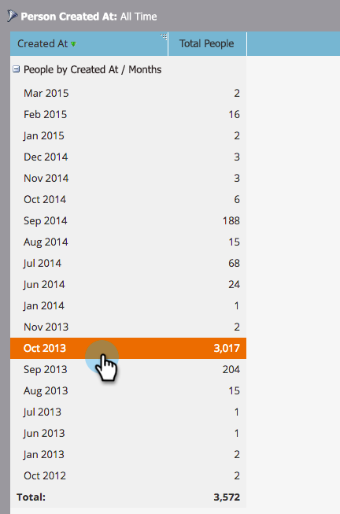
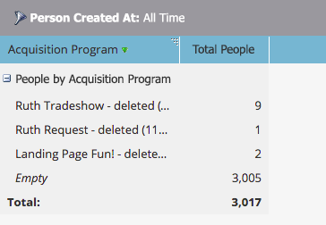
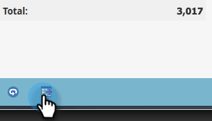

# Drill Down in a People Performance Report {#drill-down-in-a-people-performance-report}

Drill down in a People Performance Report to see additional person information.

>[!NOTE]
>
>**FYI**
>
>Marketo is now standardizing language across all subscriptions, so you may see lead/leads in your subscription and person/people in docs.marketo.com. These terms mean the same thing; it does not affect article instructions. There are some other changes, too. [Learn more](http://docs.marketo.com/display/DOCS/Updates+to+Marketo+Terminology).

1. Click the **Report** tab to view any existing report.

   

1. Select a row in the report that you would like to learn more about.

   

1. Click on **Drill-Down**.

   

1. In the **Drill-Down** pop-up, select the attribute you would like to drill down to. Then click** Drill-Down**.

   

1. Great job! The drill-down report will open in a new tab. Now you can explore the new report.

   >[!TIP]
   >
   >If you don't see a new report tab open, your browser might be blocking pop-ups. Change your browser settings to allow it.

   

1. To save your results (optional), click the **Export** icon on the bottom-left.

   

