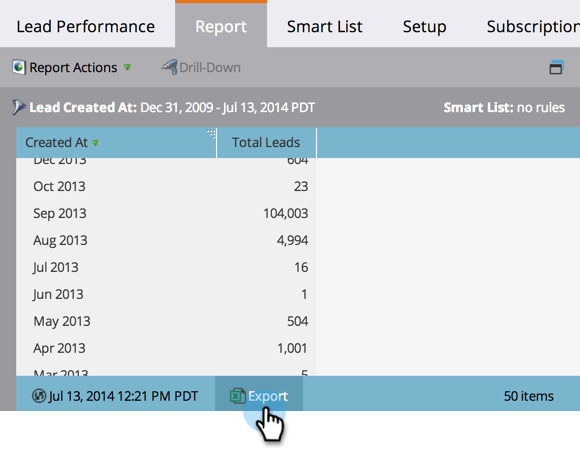

# Export a Report to Excel {#export-a-report-to-excel}

You can export any report to an Excel file, to work with the data in other software.

1. Go to the **Marketing Activities** area.

   

1. Select your report from the navigation tree and click the **Report** tab.

   

1. Click the **Export** button.

   

   That's all! Your browser prompts you to save the Excel file to your system.

   >[!MORELIKETHIS]
   >
   >If the downloaded file is too big, you can [change the report size](/help/marketo/product-docs/reporting/basic-reporting/editing-reports/configure-report-size.md).
