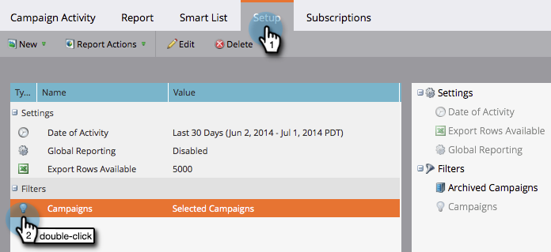
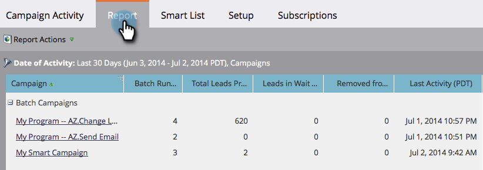

# Filter a Campaign Activity Report {#filter-a-campaign-activity-report}

Focus your [Campaign Activity Report](../../../../product-docs/reporting/basic-reporting/report-types/campaign-activity-report.md)on specific [smart campaigns](http://docs.marketo.com/display/docs/smart+campaigns).

1. Go to **Marketing Activities** (or **Analytics**) and select your campaign activity report.

   

1. Click the **Setup** tab and double-click **Campaigns.**

   

1. Choose the folders and specific smart campaigns to include in your report. Click **Apply**. 

   

   >[!TIP]
   >
   >If you select a folder, your report will include everything that folder contains at the time the report runs. 

1. You're done! Click the **Report** tab to see *just* the selected smart campaigns in your report.

   

>[!MORELIKETHIS]
>
>* [Campaign Email Performance Report](../../../../product-docs/reporting/basic-reporting/report-types/campaign-email-performance-report.md)
>

>[!NOTE]
>
>**Deep Dive**
>
>Learn all about reports in [Basic Reporting](http://docs.marketo.com/display/docs/basic+reporting).

