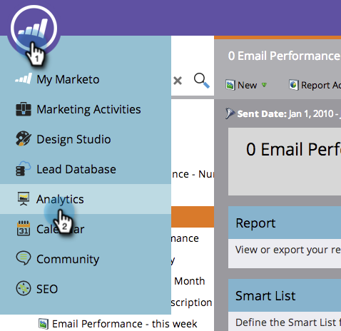
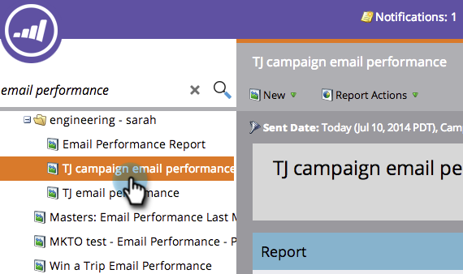
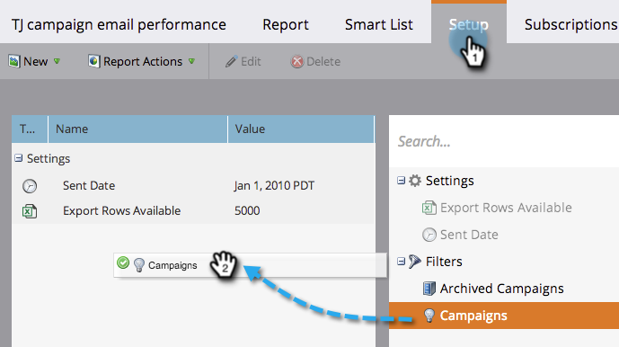
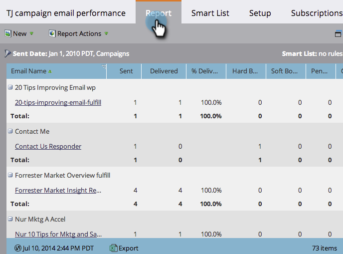

# Filter Assets in a Campaign Email Reports {#filter-assets-in-a-campaign-email-reports}

Focus your [Campaign Email Performance](/help/marketo/product-docs/reporting/basic-reporting/report-types/campaign-email-performance-report.md) report on specific [smart campaigns](/help/marketo/product-docs/core-marketo-concepts/smart-campaigns/creating-a-smart-campaign/understanding-batch-and-trigger-smart-campaigns.md) in your programs ('local assets') or on those that have been archived.

>[!NOTE]
>
>Filtering assets in reports is not supported in Satellite Mode (the 'open in a new window' icon on the right of the asset detail page).

1. Go to **Analytics** (or **Marketing Activities**) area.

   

1. Select your email performance report.

   

1. Click the **Setup** tab and drag over a filter.

   

    * **Campaigns**: Active smart campaigns in your Marketo account.
    * **Archived Campaigns**: Inactive, retired smart campaigns.

1. Choose the folders and specific smart campaigns to include in your report.

   

   >[!TIP]
   >
   >If you select a folder, your report will include everything that folder contains at the time the report runs.

1. You're done! Click the **Report** tab to see your filtered report.

   

   >[!MORELIKETHIS]
   >
   >[Campaign Email Performance Report](/help/marketo/product-docs/reporting/basic-reporting/report-types/campaign-email-performance-report.md)
   >[Filter Assets in an Email Report](/help/marketo/product-docs/reporting/basic-reporting/report-activity/filter-assets-in-an-email-report.md)
