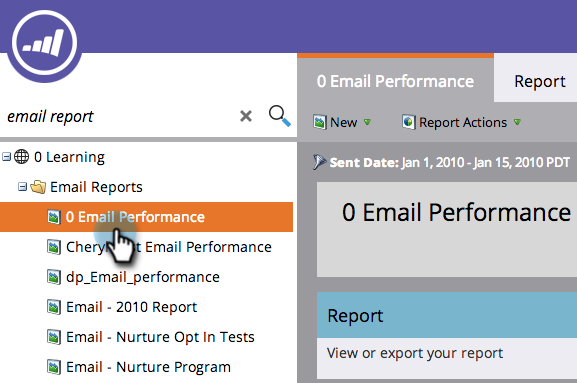
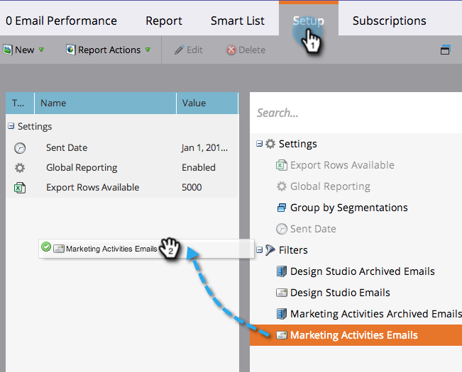

# Filter Assets in an Email Report {#filter-assets-in-an-email-report}

Focus your [Email Performance](/help/marketo/product-docs/email-marketing/email-programs/email-program-data/email-performance-report.md) or [Email Link Performance](/help/marketo/product-docs/email-marketing/email-programs/email-program-data/email-link-performance-report.md) report on emails in your programs ('local assets'), on those in Design Studio ('global assets'), or on those that have been archived.

>[!NOTE]
>
>Filtering assets in reports is not supported in Satellite Mode (the 'open in a new window' icon on the right of the asset detail page).

1. Go to **Analytics** (or **Marketing Activities**) area.

   

1. Select your email report.

   

1. Click the **Setup** tab and drag over a filter.

   

    * **Design Studio Emails**: Global assets, managed in the Design Studio.
    * **Marketing Activities Emails**: Local assets in programs on the Marketing Activities tab.
    * **Archived Emails**: Inactive, retired emails.

1. Choose the folders and specific emails to include in your report.

   

   >[!TIP]
   >
   >If you select a folder, your report will include everything that folder contains at the time the report runs.

1. You're done! Click the **Report** tab to see your filtered report.

   

>[!MORELIKETHIS]
>
>[Filter Assets in a Campaign Email Reports](/help/marketo/product-docs/reporting/basic-reporting/report-activity/filter-assets-in-a-campaign-email-reports.md)
