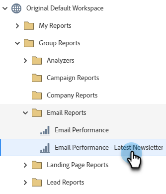
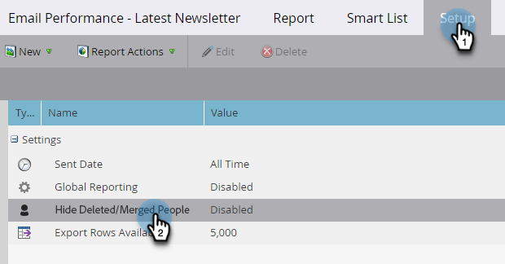
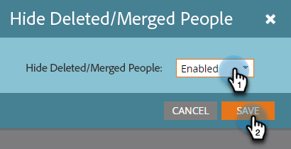

# Filter Deleted/Merged records in an Email Performance Report {#filter-deleted-merged-records-in-an-email-performance-report}

Focus your Email Performance report on emails in your programs ('local assets'), on those in Design Studio ('global assets'), or on those that have been archived.

>[!NOTE]
>
>Filtering assets in reports is not supported in Satellite Mode (the 'open in a new window' icon on the right of the asset detail page).

1. Go to the **Analytics** (or Marketing Activities) area.

   

1. Select your Email Performance Report.

   

1. Click the **Setup** tab and select **Hide Deleted/Merged People**.

   

1. Click the drop-down, select **Enabled**, and click **Save**.

   

You're done! Click the Report tab to see your filtered report.
