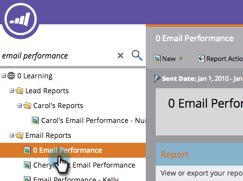
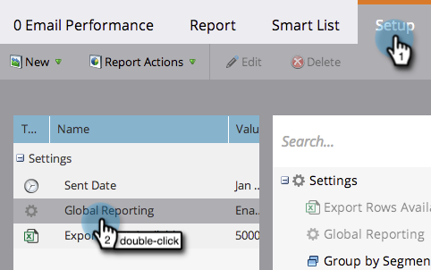
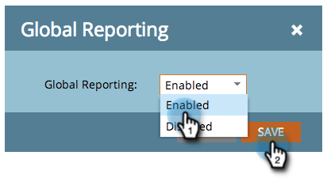
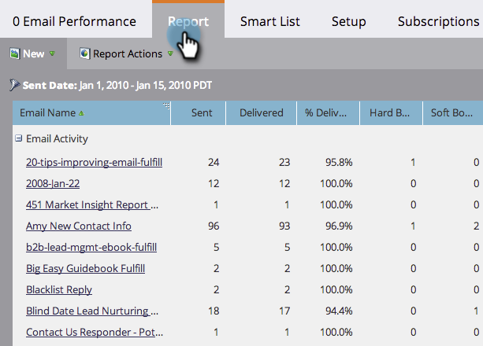

# Report Email, Campaign Performance Across Workspaces {#report-email-campaign-performance-across-workspaces}

Report Email, Campaign Performance Across Workspaces - Marketo Docs - Product Documentation

Turn on Global Reporting to include data from all your Marketo [workspaces](../../../../product-docs/administration/workspaces-and-person-partitions/create-a-new-workspace.md) in your [Email Performance](../../../../product-docs/email-marketing/email-programs/email-program-data/email-performance-report.md), [Email Link performance](../../../../product-docs/email-marketing/email-programs/email-program-data/email-link-performance-report.md), and [Campaign Activity](../../../../product-docs/reporting/basic-reporting/report-types/campaign-activity-report.md) reports.

1. Go to **Analytics** (or **Marketing Activities**) area.

   

1. Select your report.

   

1. Click the **Setup** tab and double-click **Global Reporting**.

   

1. Select **Enabled**.

   

1. That's all! Click the **Report** tab to see data from all your workspaces.

   

   >[!NOTE]
   >
   >**Related Articles**
   >
   >    
   >    
   >    * [Filter Assets in an Email Report](filter-assets-in-an-email-report.md)
   >    
   >

   >[!NOTE]
   >
   >**Deep Dive**
   >
   >
   >Learn all about reports in&nbsp; [Basic Reporting](../../../../product-docs/reporting/basic-reporting.md)  .

