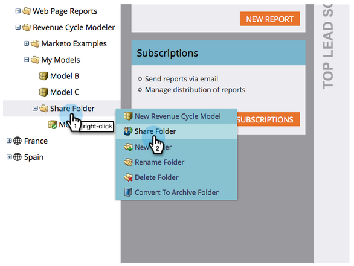

# Share a Model Across Workspaces {#share-a-model-across-workspaces}

Marketo gives you the ability to share a model(s) across workspaces. Here's how.

1. Go to the **[!UICONTROL Analytics]** section.

   

1. Right click the **[!UICONTROL My Models]** folder and click on **[!UICONTROL New Folder]**.

   

1. Name the folder.

   

1. Drag the model(s) you want to share into the **[!UICONTROL Share Folder]**.

   

1. Right click your folder and click **[!UICONTROL Share Folder]**.

   

   >[!NOTE]
   >
   >Sharing a model with another workspace allows those users to run reports based on the model.

1. Select the workspaces you want to share the folder with and click **[!UICONTROL Save]**.

   

It is that easy! Now people from other workspaces can move through the shared model.
