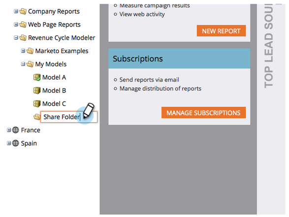

# Share a Model Across Workspaces {#share-a-model-across-workspaces}

Share a Model Across Workspaces - Marketo Docs - Product Documentation

Marketo gives you the ability to share a model(s) across workspaces. Here's how.

>[!NOTE]
>
>**FYI**
>
>Marketo is now standardizing language across all subscriptions, so you may see lead/leads in your subscription and person/people in docs.marketo.com. These terms mean the same thing; it does not affect article instructions. There are some other changes, too. [Learn more](http://docs.marketo.com/display/DOCS/Updates+to+Marketo+Terminology).

1. Go to the **Analytics** section.

   

1. Right click the **My Models** folder and click on **New Folder**.

   

1. Name the folder.

   

1. Drag the model(s) you want to share into the **Share Folder**.

   

1. Right click your folder and click **Share Folder**.

   

   >[!NOTE]
   >
   >
   >Sharing a model with another workspace allows those users to run reports based on the model.

1. Select the workspaces you want to share the folder with and click **Save**.

   

It's that easy! Now people from other workspaces can move through the shared model. You may want to run person assignment in that workspace, see&nbsp; [Launching Your Revenue Cycle Model](https://community.marketo.com/MarketoArticle?id=kA050000000KyvQCAS)&nbsp;for details.
