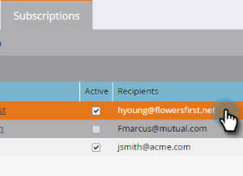

# Edit a Smart List Subscription {#edit-a-smart-list-subscription}

You can edit these columns directly in the Subscriptions tab, which appears in Marketing Activities or Database:

* Recipients
* Frequency
* Columns
* End Delivery
* Format

1. Select **Database** (we're using it in this example, but Marketing Activities works exactly the same).

   

1. Select the subscription you want to edit.

   

1. Click in the Recipients column and it opens so you can enter more email addresses (separate them with a comma).

   

1. Click the **Frequency** column to choose or change your setting.

   

1. Open the **Columns** column and use the selector to add or remove columns from the report. Report Columns contains all available columns and Marketo Columns shows only those you've selected to display in your report. Click **Save**.

   

   >[!NOTE]
   >
   >The columns under Marketo Columns are the report columns, not the ones used in the Subscriptions report tab.

1. Click the **End Date** column to edit the end date. Select **Never** or **Date**. For a date, enter it or choose it from the calendar. Click **Approve**.

   

1. The last piece of the puzzle is the format. Click the **Format** column and select the one you want. CSV is the default.

   
