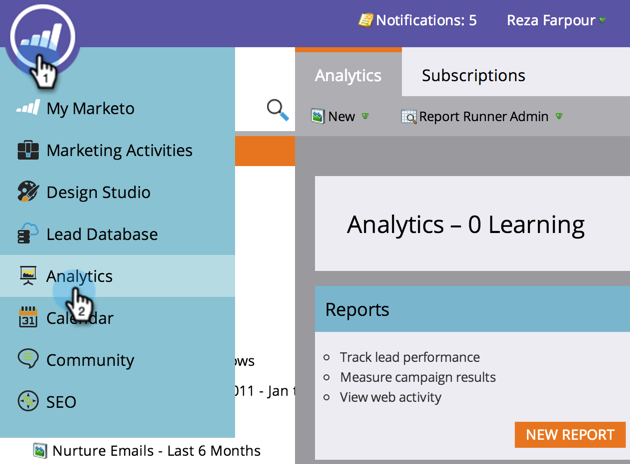
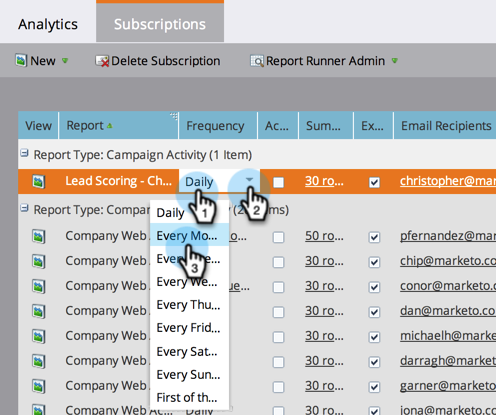
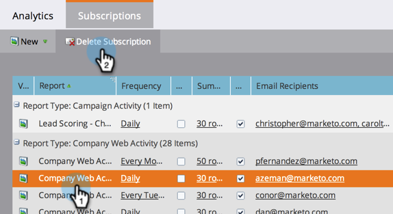
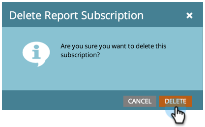

# Manage Report Subscriptions {#manage-report-subscriptions}

Manage Report Subscriptions - Marketo Docs - Product Documentation

Configure and delete report subscriptions.

1. Go to the **Analytics** area.

   

1. Click the **Subscriptions** tab.

   

   This page displays the subscriptions to all the reports in your account, grouped by [report type](../../../../product-docs/reporting/basic-reporting/report-types/report-type-overview.md). This includes [subscriptions to basic reports](subscribe-to-a-basic-report.md) and to [Revenue Cycle Explorer](../../../../product-docs/reporting/revenue-cycle-analytics.md) reports.

   >[!TIP]
   >
   >You can also manage subscriptions to an individual report in **Marketing Activities**. Select the report and click the **Subscriptions** tab.

   ##### To change how often a report is emailed, click the Frequency field and select a new option from the drop-down menu. {#to-change-how-often-a-report-is-emailed-click-the-frequency-field-and-select-a-new-option-from-the-drop-down-menu}

   

1. To change the email addresses in a subscription, click the **Email Recipients** field and edit the email addresses.

   

   >[!TIP]
   >
   >
   >    
   >    
   >    * Use commas between email addresses.
   >    * To save your edits, click in an area *outside* the subscriptions list.
   >    
   >

   ##### You can also: {#you-can-also}

    * 
      Click the **View** button to open a report. 
    * Deselect the **Active** checkbox to deactivate the subscription.
    * Click and edit the **Summary** field to change how many preview rows appear in the email.
    * Deselect the **Excel** checkbox to send report summaries without the spreadsheet attachment.
    * 
      Click the **Send** button to send the report email immediately.

1. To delete a subscription altogether, select the row and click **Delete Subscription**.

   

1. Confirm your intention to delete the subscription.

   

   >[!NOTE]
   >
   >**Related Articles**
   >
   >    
   >    
   >    * [Subscribe to a Basic Report](subscribe-to-a-basic-report.md)
   >    * [Subscribe to a Revenue Explorer Report](../../../../product-docs/reporting/revenue-cycle-analytics/revenue-explorer/subscribe-to-a-revenue-explorer-report.md)
   >    
   >

   Learn more in the&nbsp; [Basic Reporting](../../../../product-docs/reporting/basic-reporting.md)&nbsp;and&nbsp; [Revenue Cycle Explorer](../../../../product-docs/reporting/revenue-cycle-analytics.md)&nbsp;deep dives.&nbsp;

