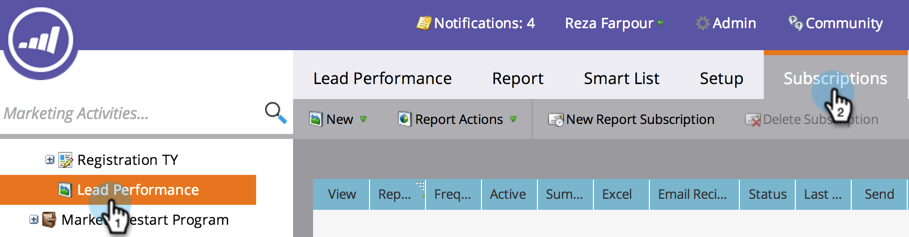
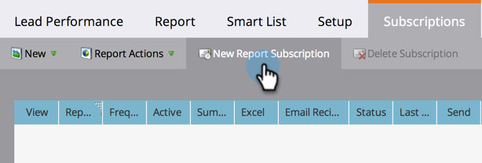
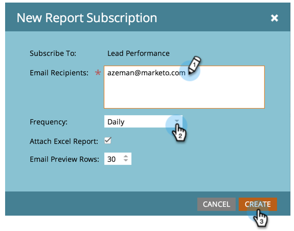

# Subscribe to a Basic Report {#subscribe-to-a-basic-report}

To receive automatic updates of a [basic report](http://docs.marketo.com/display/docs/basic+reporting), or to share them, you can subscribe any email address to an existing report.

>[!NOTE]
>
>For [Revenue Cycle Explorer](http://docs.marketo.com/display/docs/revenue+cycle+analytics) report subscriptions, see [Subscribe to a Revenue Explorer Report](../../../../product-docs/reporting/revenue-cycle-analytics/revenue-explorer/subscribe-to-a-revenue-explorer-report.md).

1. Go to the **Marketing Activities **area.

   

1. Select your report from the navigation tree and click the **Subscriptions** tab.

   

   >[!NOTE]
   >
   >You can also subscribe to reports from the **Analytics** tab.

1. Click **New Report Subscription**.

   

1. Enter the email address(es) and set the frequency of the report emails.

   

   >[!NOTE]
   >
   >Anyone can unsubscribe from the report in the email they receive.

   That's it! Check your inbox!

   

   >[!NOTE]
   >
   >**Related Articles**
   >
   >
   >Learn how to [manage all your report subscriptions](manage-report-subscriptions.md) in one place.

   >[!NOTE]
   >
   >**Deep Dive**
   >
   >
   >See what else you can do with reports in the [Basic Reporting](http://docs.marketo.com/display/docs/basic+reporting) deep dive.

