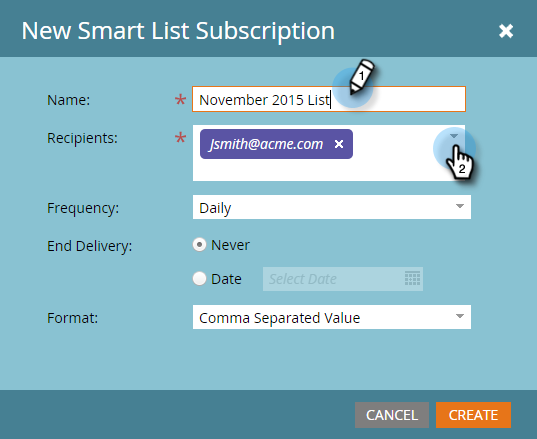
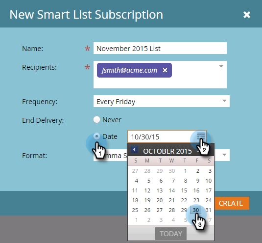
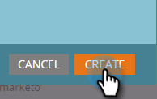
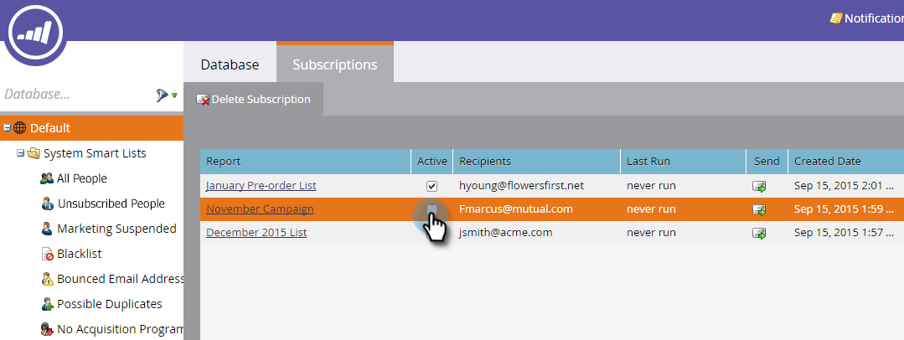
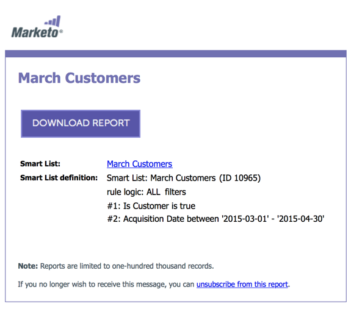
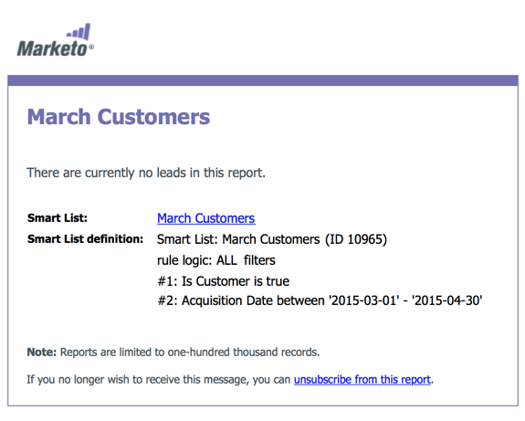
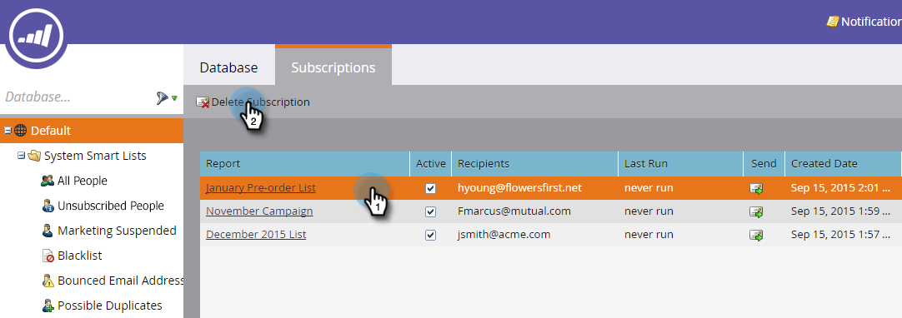

# Subscribe to a Smart List {#subscribe-to-a-smart-list}

Subscribing to smart lists is a great way to keep track of people, with reports sent right to your inbox.

You can create a smart list subscription in two separate places:

* Marketing Activities
* Database

Subscriptions use the full list of people at the time the subscription runs.

Subscriptions live where your smart list lives, in Marketing Activities or Database.

You can create multiple subscriptions from the same smart list.

Subscriptions are workspace specific. For example, this list of subscriptions is in a different workspace from the ones shown in the rest of this article:

>[!NOTE]
>
>You are limited to 100 subscriptions and a maximum of 100,000 people per subscription, across workspaces, per Marketo instance. If the smart list contains more than 100,000 names, Marketo will run the subscription for the first 100,000.

## Create a Smart List Subscription {#create-a-smart-list-subscription}

1. Go to the **Database **or** Marketing Activities**.

   

1. Select the smart list you wish to create a subscription for. Click **List Actions** and select** New Smart List Subscription**.

   

1. Give your subscription a **Name**, then select or enter the email addresses of the **Recipients**.

   

1. Click the **Frequency** list and select a frequency.

   ** 

   **

1. Set the **End Delivery **date. You can select **Never** or a calendar date.

   

1. Click **Format** and choose from the list.

   

1. Click **Create**.

   

1. Your new smart list subscription appears at the top of the list in the Subscriptions tab. Click **Send** if you want to send now, and not wait until the scheduled email delivery.

   

1. We recommend that you clear the Active checkbox to deactivate a smart list subscription if nobody is subscribed to it.

   

   That was easy, wasn't it?

## Email Message {#email-message}

   Recipients will receive an email with an option to download the report, as well as a link directly to the list within the Marketo instance. The download link expires in four days.

   >[!NOTE]
   >
   >If the [Secure Subscription Admin](secure-the-subscription-admin-setting.md) setting is set to **Yes**, only people with access to the Marketo instance will be able to download the report.

   

   If a report has 0 people in it, recipients will still receive an email. However, the email simply states that there are no people to report.

   

   >[!NOTE]
   >
   >When you modify a smart list filter you've based a subscription on, it updates the report as well.

The email also provides additional information about the filters used to create the list. 

## Delete a Subscription {#delete-a-subscription}

To delete a subscription, select it in the subscriptions tab and click Delete Subscription.

>[!MORELIKETHIS]
>
>* [Edit a Smart List Subscription](edit-a-smart-list-subscription.md)
>* [Secure the Subscription Admin Setting](secure-the-subscription-admin-setting.md)
>

