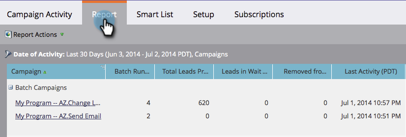

# Campaign Activity Report {#campaign-activity-report}

See how your [smart campaigns](http://docs.marketo.com/display/docs/smart+campaigns) are performing.

1. [Create a report](../../../../product-docs/reporting/basic-reporting/creating-reports/create-a-report-in-a-program.md) and select the **Campaign Activity** [report type](report-type-overview.md).
1. [Set the time frame of your report](../../../../product-docs/reporting/basic-reporting/editing-reports/change-a-report-time-frame.md) and click the **Report** tab.
1. Great! Explore your report to identify your most effective campaigns, grouped by campaign type.

   ` 

   `

   >[!TIP]
   >
   >To find the campaigns that processed the most people, for example,  [sort your report](../../../../product-docs/reporting/basic-reporting/editing-reports/sort-report-on-columns.md)on *Total People Processed* and choose **Sort Descending**. 

   Click the name of a smart campaign to open it.  [Columns that you can select](../../../../product-docs/reporting/basic-reporting/editing-reports/select-report-columns.md) for a Campaign Activity report include:

   | Column |Description |
   |---|---|
   | Batch Run Count |Number of times the campaign was run. |
   | Total People Processed |Number of people who have been through the campaign's flow. |
   | People in Wait Step |If a campaign is still running, the number of people that remain in the *Wait* step. |
   | Removed from Flow |Number of people who have been removed from the campaign. |
   | Last Activity |The last time that a person was processed by the campaign. |

   Campaign types in the report:

   | Type |Description |
   |---|---|
   | Batch |Batch campaigns in the **Marketing Activities** tab. |
   | Run Action |Person Actions run from the **Database**. |
   | Triggered (Active) |Current triggered campaigns in the **Marketing Activities** tab. |
   | Triggered (Inactive) |Inactive triggered campaigns in the **Marketing Activities** tab. |

   >[!MORELIKETHIS]
   >
   >
   >    
   >    
   >    * [Filter a Campaign Activity Report](../../../../product-docs/reporting/basic-reporting/report-activity/filter-a-campaign-activity-report.md)
   >    
   >

   See more reports in [Basic Reporting](http://docs.marketo.com/display/docs/basic+reporting).

