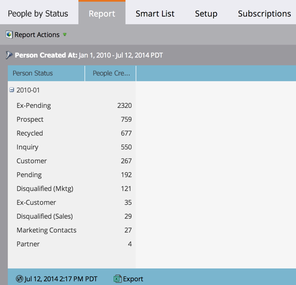

# People by Status Report {#people-by-status-report}

Review how well you're moving people through the process by checking how many of them appear in each _Person Status_ value every month.

1. [Create a report](/help/marketo/product-docs/reporting/basic-reporting/creating-reports/create-a-report-in-a-program.md) and select the **People by Status** [report type](/help/marketo/product-docs/reporting/basic-reporting/report-types/report-type-overview.md).

1. [Set the time frame of your report](/help/marketo/product-docs/reporting/basic-reporting/editing-reports/change-a-report-time-frame.md) and click the **Report** tab.

1. Great! Now you can see how many people were in each Person Status, from month to month.

   

   >[!TIP]
   >
   >Click the plus (+) to expand each month and see the specific numbers for each person status.

   >[!MORELIKETHIS]
   >
   >[Use a smart list to filter your report](/help/marketo/product-docs/reporting/basic-reporting/editing-reports/filter-people-in-a-report-with-a-smart-list.md) to specific people.
