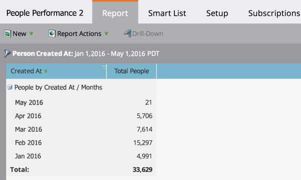

# People Performance Report {#people-performance-report}

People Performance Report - Marketo Docs - Product Documentation

Use a People Performance Report to measure database growth over time. You can see how many people you added, and when. Learn more about the people and assess your programs. Group the results by any person or company attribute, or by [segmentation](../../../../product-docs/personalization/segmentation-and-snippets/segmentation/create-a-segmentation.md).

>[!NOTE]
>
>**FYI**
>
>Marketo is now standardizing language across all subscriptions, so you may see lead/leads in your subscription and person/people in docs.marketo.com. These terms mean the same thing; it does not affect article instructions. There are some other changes, too. [Learn more](http://docs.marketo.com/display/DOCS/Updates+to+Marketo+Terminology).

1. [Create a report](../../../../product-docs/reporting/basic-reporting/creating-reports/create-a-report-in-a-program.md) and select the **People Performance** [report type](report-type-overview.md).
1. [Set the time frame of your report](../../../../product-docs/reporting/basic-reporting/editing-reports/change-a-report-time-frame.md) and click the **Report** tab.
1. Great! Now you're ready to explore your People Performance report. Learn how to get even more from it in the list below.

   >[!NOTE]
   >
   >By default, People Performance reports are grouped by *Created At* month.

   

   #### The Power of People Performance Reports {#the-power-of-people-performance-reports}

   People Performance reports are very powerful. By further grouping, filtering, and configuring them, you can learn a lot about the people in your Database, and about the effectiveness of your programs. 
   You can:

    * [Group leads by lead or company attribute](../../../../product-docs/reporting/basic-reporting/report-activity/group-person-reports-by-attribute.md).
    * [Group leads by segment](../../../../product-docs/personalization/segmentation-and-snippets/segmentation/group-person-reports-by-segment.md).
    * [Use smart lists as custom report columns.](../../../../product-docs/reporting/basic-reporting/editing-reports/add-custom-columns-to-a-person-report.md)
    * [Add opportunity metrics as report columns.](../../../../product-docs/reporting/basic-reporting/editing-reports/add-opportunity-columns-to-a-lead-report.md)
    * [Drill down to learn more about the leads in a specific row.](../../../../product-docs/reporting/basic-reporting/report-activity/drill-down-in-a-people-performance-report.md)
    * [Filter the leads in your report with a smart list.](../../../../product-docs/reporting/basic-reporting/editing-reports/filter-people-in-a-report-with-a-smart-list.md)
    * [Select the columns to include.](../../../../product-docs/reporting/basic-reporting/editing-reports/select-report-columns.md)
    * [Sort your report columns.](../../../../product-docs/reporting/basic-reporting/editing-reports/sort-report-on-columns.md)

   >[!TIP]
   >
   >Remember that reports are easy to [create](../../../../product-docs/reporting/basic-reporting/creating-reports/create-a-report-in-a-program.md), [configure](../../../../product-docs/reporting/basic-reporting.md), and [delete](../../../../product-docs/reporting/basic-reporting/report-activity/delete-a-report.md). Go ahead and play with the many ways you can manipulate them, to learn the best ways to focus on key data.

   >[!NOTE]
   >
   >**Deep Dive**
   >
   >
   >Learn more in the [Basic Reporting](../../../../product-docs/reporting/basic-reporting.md)deep dive.

